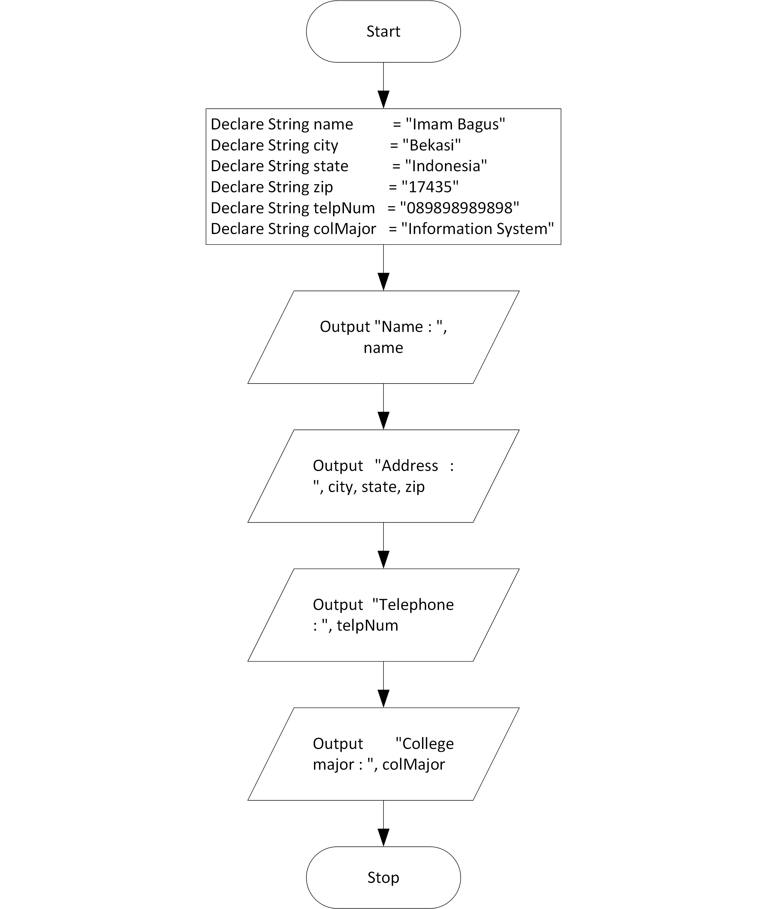

# Personal Information Program

## Case

Design program that display the following information:

- Name
- address incluce City, State , ZIP
- Telephone Number
- College major

<hr>

## Pseudocode

```
Declare	String name 	= "Imam Bagus"
Declare	String city 	= "Bekasi"
Declare	String state	= "Indonesia"
Declare	String zip		= "17435"
Declare	String telpNum	= "089898989898"
Declare	String colMajor	= "Information System"

Output "Name : ", name
Output "Address : ", city, state, zip
Output "Telephone : ", telpNum
Output "College major : ", colMajor
```

<hr>

## Flowchart



<hr>

## Source Code

- [C++](personalInformation.cpp)
- [Java](personalInformation.java)
- [Python](personalInformation.py)
- [PHP](personalInformation.php)
- [JavaScript](personalInformation.js)
