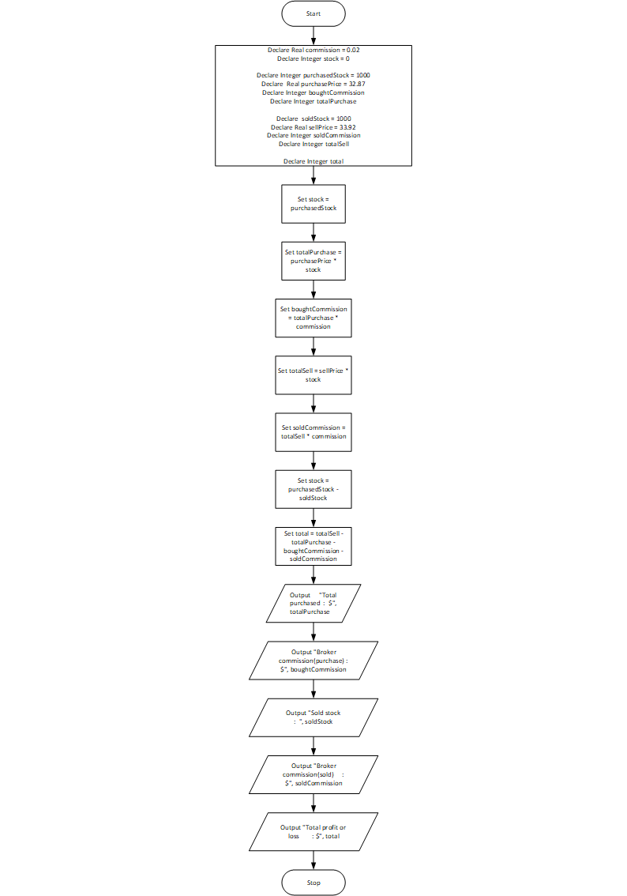

# Stock Transaction Program

## Case

Last month Joe purchased some stock in Acme Software, Inc. Here are the details
of the purchase:

- The number of shares that Joe purchased was 1,000.
- When Joe purchased the stock, he paid $32.87 per share.
- Joe paid his stockbroker a commission that amounted to 2 percent of the amount he paid for the stock.

Two weeks later Joe sold the stock. Here are the details of the sale:

- The number of shares that Joe sold was 1,000.
- He sold the stock for $33.92 per share.
- He paid his stockbroker another commission that amounted to 2 percent of the amount he received for the stock.

Design a program that displays the following information:

- The amount of money Joe paid for the stock.
- The amount of commission Joe paid his broker when he bought the stock.
- The amount that Joe sold the stock for.
- The amount of commission Joe paid his broker when he sold the stock.
- Did Joe make money or lose money? Display the amount of profit or loss after Joe sold the stock and paid his broker (both times).

<hr>

## Pseudocode

```
Declare Real commission = 0.02
Declare Integer stock = 0

Declare Integer purchasedStock = 1000
Declare  Real purchasePrice = 32.87
Declare Integer boughtCommission
Declare Integer totalPurchase

Declare  soldStock = 1000
Declare Real sellPrice = 33.92
Declare Integer soldCommission
Declare Integer totalSell

Declare Integer total

Set stock = purchasedStock
Set totalPurchase = purchasePrice * stock
Set boughtCommission = totalPurchase * commission

Set totalSell = sellPrice * stock
Set soldCommission = totalSell * commission
Set stock = purchasedStock - soldStock

Set total = totalSell - totalPurchase - boughtCommission - soldCommission

Output "Total purchased             : $", totalPurchase
Output "Broker commission(purchase) : $", boughtCommission
Output "Sold stock                  :  ", soldStock
Output "Broker commission(sold)     : $", soldCommission
Output "Total profit or loss        : $", total

```

<hr>

## Flowchart



<hr>

## Source Code

- [C++](stockTransaction/.cpp)
- [Java](stockTransaction/.java)
- [Python](stockTransaction/.py)
- [PHP](stockTransaction/.php)
- [JavaScript](stockTransaction/.js)
