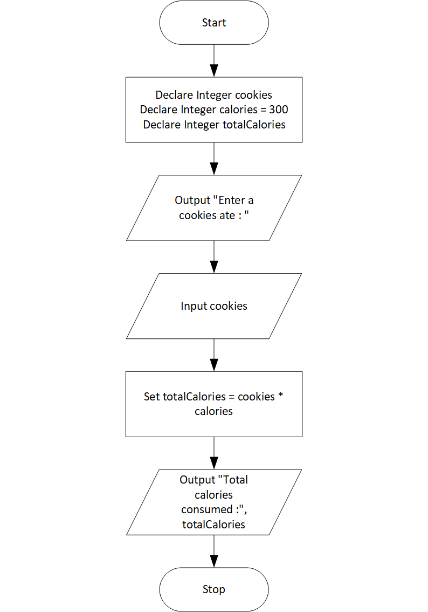

# Cookie Calories Program

## Case

A bag of cookies holds 40 cookies. The calorie information on the bag claims that there are 10 servings in the bag and that a serving equals 300 calories. Design a program that lets the user enter the number of cookies he or she actually ate and then reports the number of total calories consumed

<hr>

## Pseudocode

```
Declare Integer cookies
Declare Integer calories = 300
Declare Integer totalCalories

Output "Enter a cookies ate : "
Input cookies

Set totalCalories = cookies * calories

Output "Total calories consumed :", totalCalories

```

<hr>

## Flowchart



<hr>

## Source Code

- [C++](cookieCalories.cpp)
- [Java](cookieCalories.java)
- [Python](cookieCalories.py)
- [PHP](cookieCalories.php)
- [JavaScript](cookieCalories.js)
