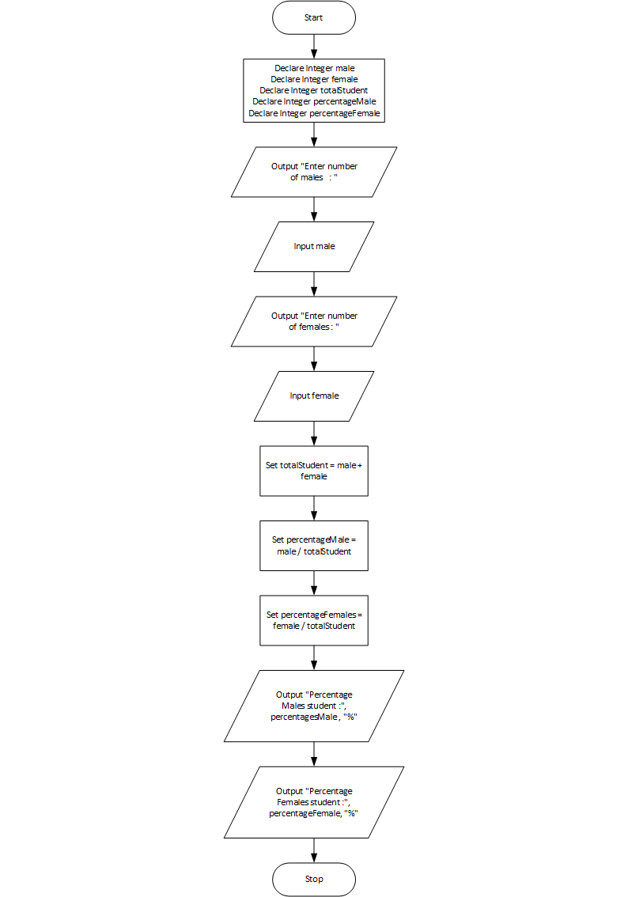

# Male and Female Percentages

## Case

Design a program that asks the user for the number of males and the number of females registered in a class. The program should display the percentage of males and females in the class.

Suppose there are 8 males and 12 females in a class. There are 20 students in the class. The percentage of males can be calculated as 8 ÷ 20 = 0.4, or 40%. The percentage of females can be calculated as 12 ÷ 20 = 0.6, or 60%.

<hr>

## Pseudocode

```
Declare Integer male
Declare Integer female
Declare Integer totalStudent
Declare Integer percentageMale
Declare Integer percentageFemale

Output "Enter number of males   : "
Input male
Output "Enter number of females : "
Input female

Set totalStudent = male + female
Set percentageMale = male / totalStudent
Set percentageFemales = female / totalStudent

Output "Percentage Males student :", percentagesMale , "%"
Output "Percentage Females student :", percentageFemale, "%"

```

<hr>

## Flowchart



<hr>

## Source Code

- [C++](maleFemalePercentages.cpp)
- [Java](maleFemalePercentages.java)
- [Python](maleFemalePercentages.py)
- [PHP](maleFemalePercentages.php)
- [JavaScript](maleFemalePercentages.js)
