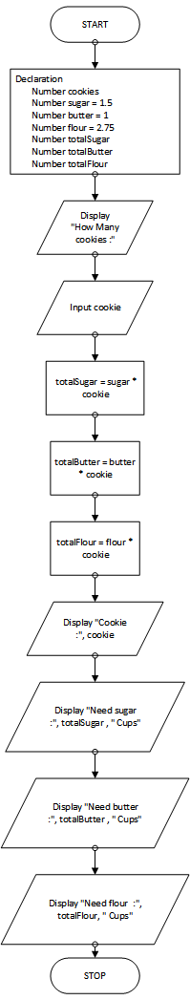

# Ingredient Adjuster Program

## Case

A cookie recipe calls for the following ingredients:

- 1.5 cups of sugar
- 1 cup of butter
- 2.75 cups of flour

The recipe produces 48 cookies with these amounts of the ingredients. Design a program that asks the user how many cookies he or she wants to make, and then displays the number of cups of each ingredient needed for the specified number of cookies.

<hr>

## Pseudocode

```
Declare Integer cookies
Declare Real sugar = 1.5
Declare Real butter = 1
Declare Real flour = 2.75
Declare Real totalSugar
Declare Real totalButter
Declare Real totalFlour

Output "How Many cookies :"
Input cookie

Set totalSugar = sugar * cookie
Set totalButter = butter * cookie
Set totalFlour = flour * cookie

Output "Cookie      :", cookie
Output "Need sugar  :", totalSugar , " Cups"
Output "Need butter :", totalButter , " Cups"
Output "Need flour  :", totalFlour, " Cups"
```

<hr>

## Flowchart



<hr>

## Source Code

- [C++](ingridientAdjuster.cpp)
- [Java](ingridientAdjuster.java)
- [Python](ingridientAdjuster.py)
- [PHP](ingridientAdjuster.php)
- [JavaScript](ingridientAdjuster.js)
