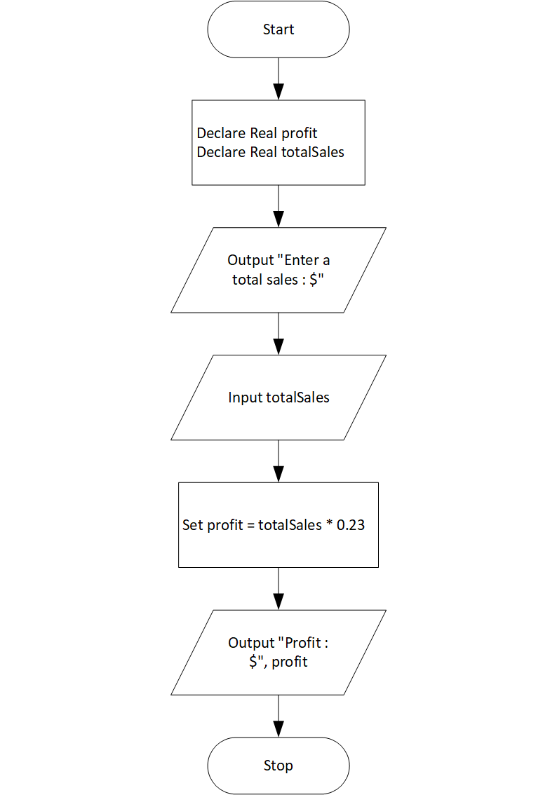

# Sales Prediction Program

## Case

A company has determined that its annual profit is typically 23 percent of total sales. Design a program that asks the user to enter the projected amount of total
sales, and then displays the profit that will be made from that amount.

<hr>

## Pseudocode

```
Declare Real profit
Declare Real totalSales

Output "Enter a total sales : $"
Input totalSales

Set profit = totalSales * 0.23

Output "Profit : $", profit

```

<hr>

## Flowchart



<hr>

## Source Code

- [C++](salesPrediction.cpp)
- [Java](salesPrediction.java)
- [Python](salesPrediction.py)
- [PHP](salesPrediction.php)
- [JavaScript](salesPrediction.js)
