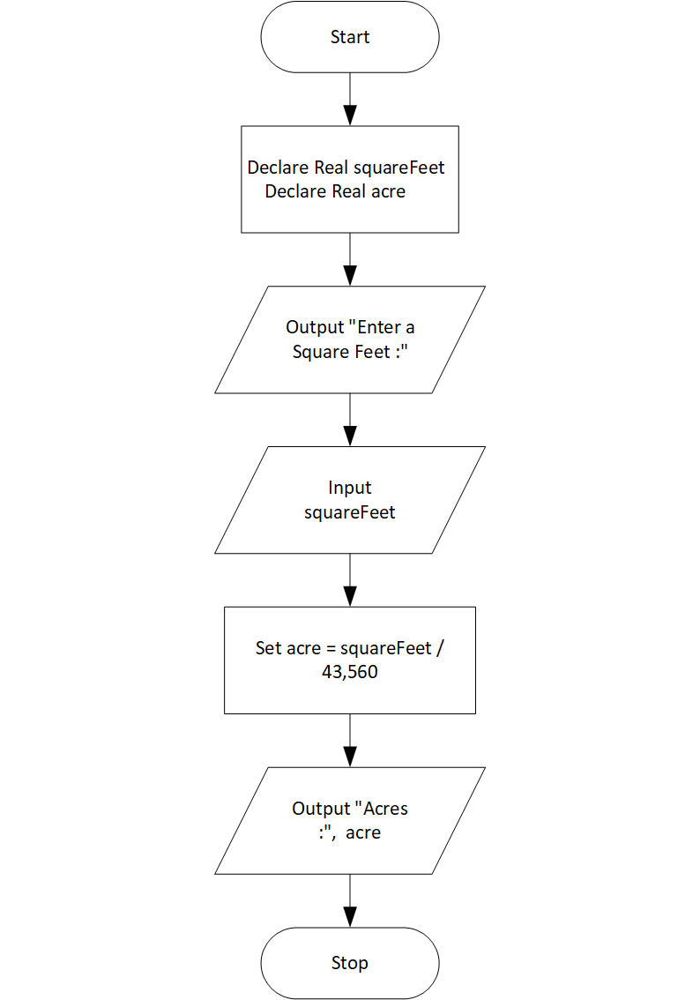

# Land Calculation Program

## Case

One acre of land is equivalent to 43,560 square feet. Design a program that asks the user to enter the total square feet in a tract of land and calculates the number of acres in the tract.

<hr>

## Pseudocode

```
    Declare Real squareFeet
    Declare Real acre

    Output "Enter a Square Feet :"
    Input squareFeet

    Set acre = squareFeet / 43,560

    Output "Acres :",  acre
```

<hr>

## Flowchart



<hr>

## Source Code

- [C++](landCalculation.cpp)
- [Java](landCalculation.java)
- [Python](landCalculation.py)
- [PHP](landCalculation.php)
- [JavaScript](landCalculation.js)
