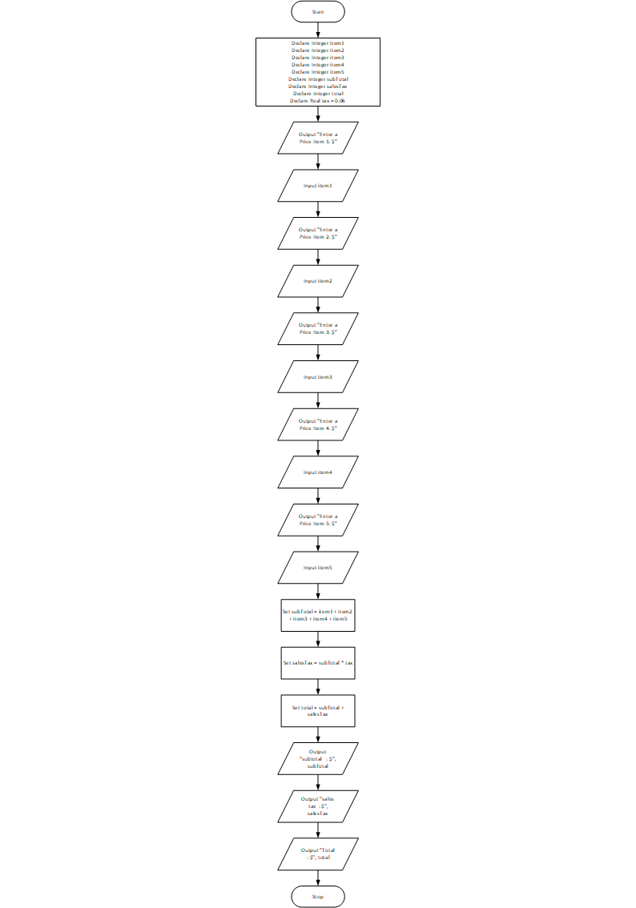

# Total Purchase Program

### Case

A customer in a store is purchasing five items. Design a program that asks for the price of each item, and then displays the subtotal of the sale, the amount of sales tax, and the total. Assume the sales tax is 6 percent.

<hr>

## Pseudocode

```
Declare Integer item1
Declare Integer item2
Declare Integer item3
Declare Integer item4
Declare Integer item5
Declare Integer subTotal
Declare Integer salesTax
Declare Integer total
Declare Real tax = 0.06

Output "Enter a Price Item 1: $"
Input item1
Output "Enter a Price Item 2: $"
Input item2
Output "Enter a Price Item 3: $"
Input item3
Output "Enter a Price Item 4: $"
Input item4
Output "Enter a Price Item 5: $"
Input item5

Set subTotal = item1 + item2 + item3 + item4 + item5
Set salesTax = subTotal * tax
Set total    = subTotal + salesTax

Output "subtotal   : $", subTotal
Output "sales tax  : $", salesTax
Output "Total      : $", total
```

<hr>

## Flowchart



<hr>

## Source Code

- [C++](totalPurchase.cpp)
- [Java](totalPurchase.java)
- [Python](totalPurchase.py)
- [PHP](totalPurchase.php)
- [JavaScript](totalPurchase.js)
