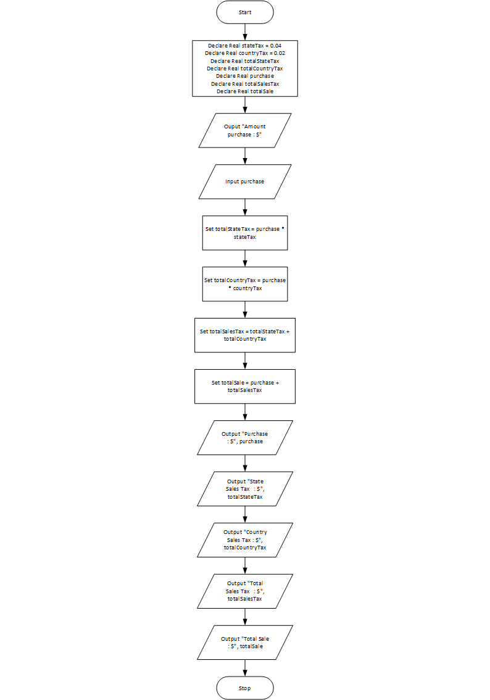

# Sales Tax Program

## Case

Design a program that will ask the user to enter the amount of a purchase. The program should then compute the state and county sales tax. Assume the state sales tax is 4 percent and the county sales tax is 2 percent. The program should display the amount of the purchase, the state sales tax, the county sales tax, the total sales tax, and the total of the sale (which is the sum of the amount of purchase plus the total sales tax).

<hr>

## Pseudocode

```
Declare Real stateTax = 0.04
Declare Real countryTax = 0.02
Declare Real totalStateTax
Declare Real totalCountryTax
Declare Real purchase
Declare Real totalSalesTax
Declare Real totalSale

Ouput "Amount purchase : $"
Input purchase

Set totalStateTax = purchase * stateTax
Set totalCountryTax = purchase * countryTax
Set totalSalesTax = totalStateTax + totalCountryTax
Set totalSale = purchase + totalSalesTax

Output "Purchase          : $", purchase
Output "State Sales Tax   : $", totalStateTax
Output "Country Sales Tax : $", totalCountryTax
Output "Total Sales Tax   : $", totalSalesTax
Output "Total Sale        : $", totalSale

```

<hr>

## Flowchart



<hr>

## Source Code

- [C++](salesTax.cpp)
- [Java](salesTax.java)
- [Python](salesTax.py)
- [PHP](salesTax.php)
- [JavaScript](salesTax.js)
