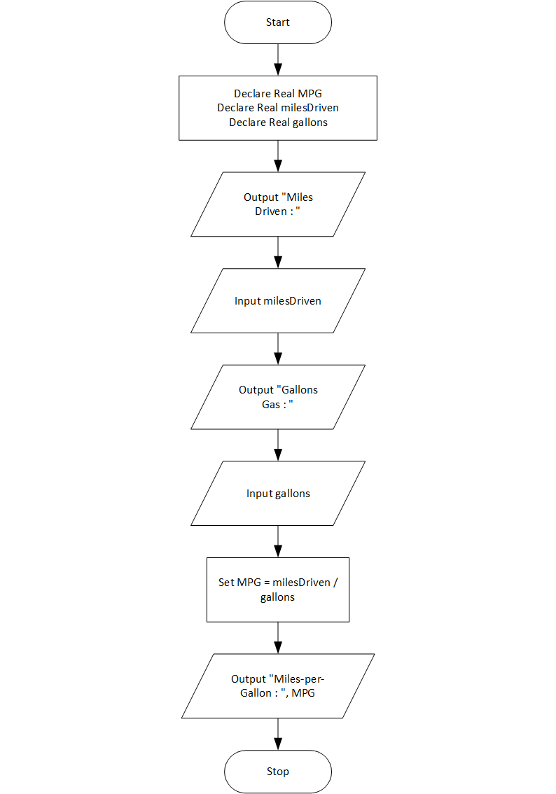

# Miles Per Gallon Program

## Case

A car’s miles-per-gallon (MPG) can be calculated with the following formula:

- MPG = Miles driven / Gallons of gas used.

Design a program that asks the user for the number of miles driven and the gallons of gas used. It should calculate the car’s miles-per-gallon and display the result on the screen

<hr>

## Pseudocode

```
Declare Real MPG
Declare Real milesDriven
Declare Real gallons

Output "Miles Driven : "
Input milesDriven
Output "Gallons Gas : "
Input gallons

Set MPG = milesDriven / gallons

Output "Miles-per-Gallon : ", MPG

```

<hr>

## Flowchart



<hr>

## Source Code

- [C++](milesPerGallon.cpp)
- [Java](milesPerGallon.java)
- [Python](milesPerGallon.py)
- [PHP](milesPerGallon.php)
- [JavaScript](milesPerGallon.js)
