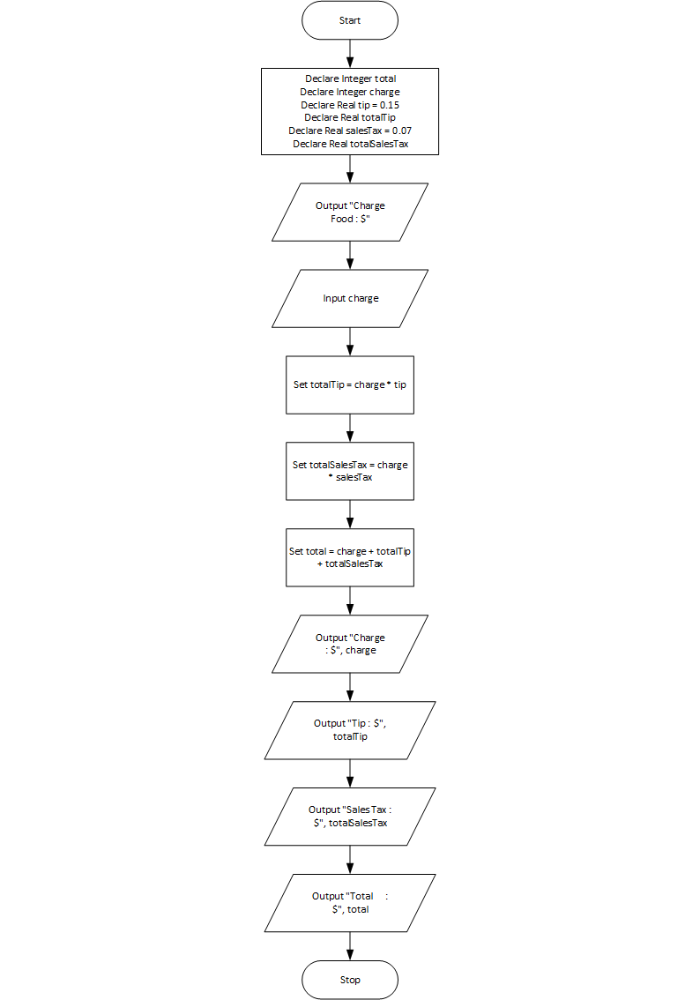

# Tip, Tax and Total program

## Case

Design a program that calculates the total amount of a meal purchased at a restaurant. The program should ask the user to enter the charge for the food, and then calculate the amount of a 15 percent tip and 7 percent sales tax. Display each of these amounts and the total

<hr>

## Pseudocode

```
Declare Integer total
Declare Integer charge
Declare Real tip = 0.15
Declare Real totalTip
Declare Real salesTax = 0.07
Declare Real totalSalesTax

Output "Charge Food : $"
Input charge

Set totalTip = charge * tip
Set totalSalesTax = charge * salesTax
Set total = charge + totalTip + totalSalesTax

Output "Charge    : $", charge
Output "Tip       : $", totalTip
Output "Sales Tax : $", totalSalesTax
Output "Total     : $", total
```

<hr>

## Flowchart



<hr>

## Source Code

- [C++](tipTaxTotal.cpp)
- [Java](tipTaxTotal.java)
- [Python](tipTaxTotal.py)
- [PHP](tipTaxTotal.php)
- [JavaScript](tipTaxTotal.js)
