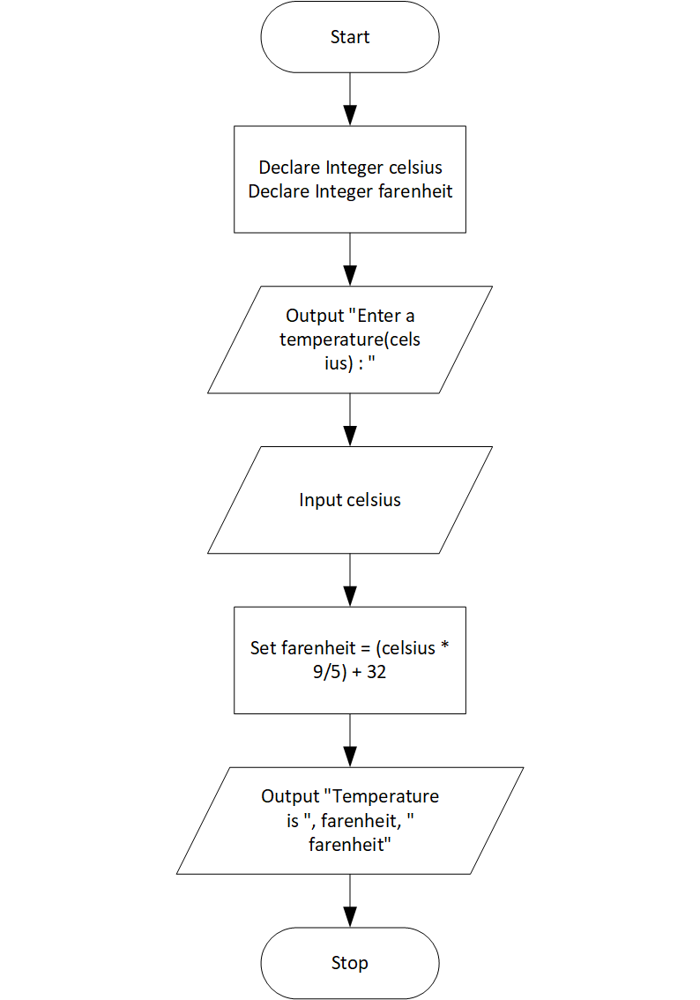

# Celcius to Farenheit Temperature Converter Program

## Case

Design a program that converts Celsius temperatures to Fahrenheit temperatures.

The formula is as follows:

F = (C \* 9 / 5) + 32.

The program should ask the user to enter a temperature in Celsius, and then display the temperature converted to Fahrenheit.

<hr>

## Pseudocode

```
Declare Integer celsius
Declare Integer farenheit

Output "Enter a temperature(celsius) : "
Input celsius

Set farenheit = (celsius * 9/5) + 32

Output "Temperature is ", farenheit, " farenheit"

```

<hr>

## Flowchart



<hr>

## Source Code

- [C++](tempConvert.cpp)
- [Java](tempConvert.java)
- [Python](tempConvert.py)
- [PHP](tempConvert.php)
- [JavaScript](tempConvert.js)
