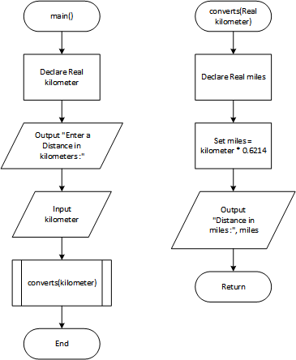

# Kilometer Converter Program

## Case

Design a modular program that asks the user to enter a distance in kilometers, and then converts that distance to miles. The conversion formula is as follows:

Miles = Kilometers x 0.6214

<hr>

## Pseudocode

```
Module main()
    Declare Real kilometer

    Output "Enter a Distance in kilometers :"
    Input kilometer

    Call converts(kilometer)
End Module

Module converts(Real Ref kilometer)
    Declare Real miles

    Set miles = kilometer * 0.6214

    Output "Distance in miles :", miles
End Module
```

<hr>

## Flowchart



<hr>

## Source Code

- [C++](kilometerConverter.cpp)
- [Java](kilometerConverter.java)
- [Python](kilometerConverter.py)
- [PHP](kilometerConverter.php)
- [JavaScript](kilometerConverter.js)
