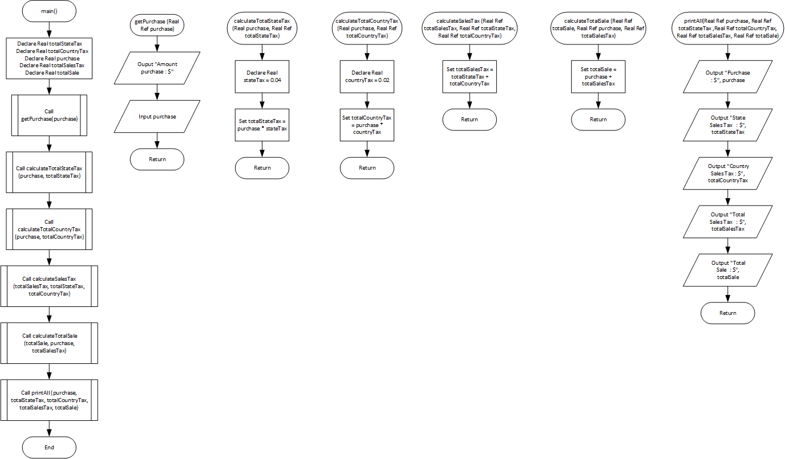
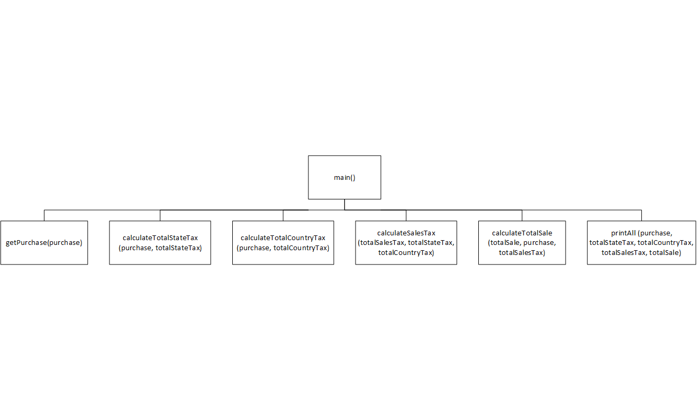

# Sales Tax Program Refactoring

## Case

Exercise CH1-input-process-output\EX6-sales-tax-program. refactor it so the subtasks are in modules.

<hr>

## Pseudocode

```
Module main()
    Declare Real totalStateTax
    Declare Real totalCountryTax
    Declare Real purchase
    Declare Real totalSalesTax
    Declare Real totalSale

    Call getPurchase(purchase)
    Call calculateTotalStateTax(purchase, totalStateTax)
    Call calculateTotalCountryTax(purchase, totalCountryTax)
    Call calculateSalesTax(totalSalesTax, totalStateTax, totalCountryTax)
    Call calculateTotalSale(totalSale, purchase, totalSalesTax)
    Call printAll(purchase, totalStateTax, totalCountryTax, totalSalesTax, totalSale)
End Module

Module getPurchase(Real Ref purchase)
    Ouput "Amount purchase : $"
    Input purchase
End Module

Module calculateTotalStateTax(Real Ref purchase, Real Ref totalStateTax)
    Declare Real stateTax = 0.04
    Set totalStateTax = purchase * stateTax
End Module

Module calculateTotalCountryTax(Real Ref purchase, Real Ref totalCountryTax)
    Declare Real countryTax = 0.02
    Set totalCountryTax = purchase * countryTax
End Module

Module calculateSalesTax(Real Ref totalSalesTax, Real Ref totalStateTax, Real Ref totalCountryTax)
    Set totalSalesTax = totalStateTax + totalCountryTax
End Module

Module calculateTotalSale(Real Ref totalSale, Real Ref purchase, Real Ref totalSalesTax)
    Set totalSale = purchase + totalSalesTax
End Module

Module printAll(Real Ref purchase, Real Ref totalStateTax ,Real Ref totalCountryTax, Real Ref totalSalesTax, Real Ref totalSale)
    Output "Purchase          : $", purchase
    Output "State Sales Tax   : $", totalStateTax
    Output "Country Sales Tax : $", totalCountryTax
    Output "Total Sales Tax   : $", totalSalesTax
    Output "Total Sale        : $", totalSale
End Module

```

<hr>

## Flowchart



<hr>

## Hierarchy chart



<hr>

## Source Code

- [C++](salesTaxRefactoring.cpp)
- [Java](salesTaxRefactoring.java)
- [Python](salesTaxRefactoring.py)
- [PHP](salesTaxRefactoring.php)
- [JavaScript](salesTaxRefactoring.js)
