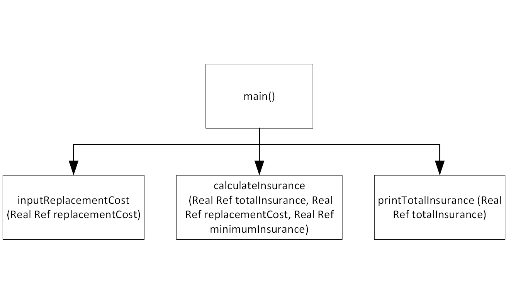

# How Much insurance program

## Case

Many financial experts advise that property owners should insure their homes or buildings for at least 80 percent of the amount it would cost to replace the structure. Design a modular program that asks the user to enter the replacement cost of a building and then displays the minimum amount of insurance he or she should buy for the property.

<hr>

## Pseudocode

```

Module main()
    Declare Real replacementCost
    Declare Real minimumInsurance = 0.8
    Declare Real totalInsurance

    Call inputReplacementCost(replacementCost)
    Call calculateInsurance(totalInsurance, replacementCost, minimumInsurance)
    Call printTotalInsurance(totalInsurance)
End Module

Module inputReplacementCost(Real Ref replacementCost)
    Output "Enter a replacement cost : $"
    Input replacementCost
End Module

Module calculateInsurance(Real Ref totalInsurance, Real Ref replacementCost, Real Ref minimumInsurance)
Set totalInsurance = (replacementCost * minimumInsurance) + replacementCost
End Module

Module printTotalInsurance(Real Ref totalInsurance)
    Output "Minimun amount insurance : $", totalInsurance
End Module

```

<hr>

## Flowchart


<hr>

## Hierarcy Chart



<hr>

## Source Code

- [C++](howMuchInsurance.cpp)
- [Java](howMuchInsurance.java)
- [Python](howMuchInsurance.py)
- [PHP](howMuchInsurance.php)
- [JavaScript](howMuchInsurance.js)
