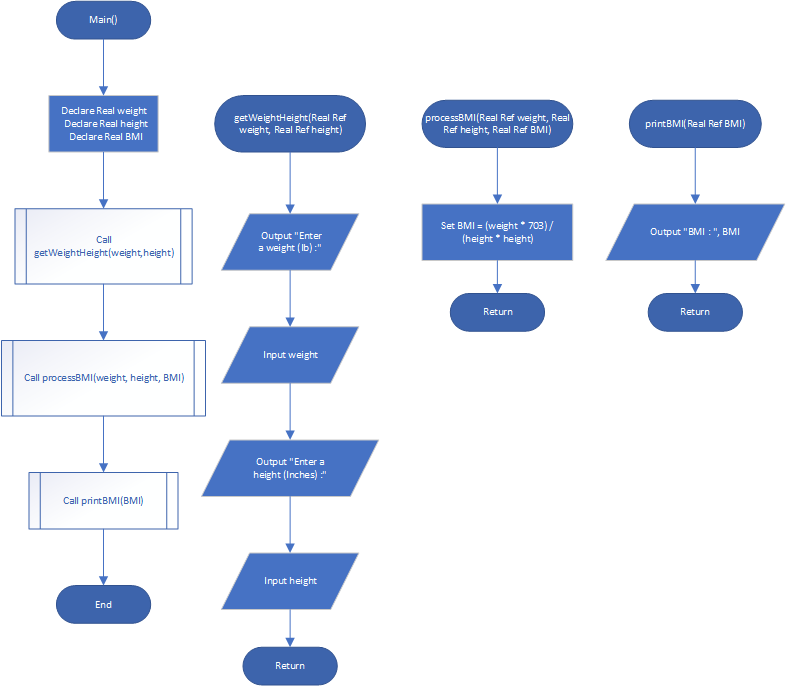

# Body Mass Index

## Case

Design a modular program that calculates and displays a person’s body mass index (BMI). The BMI is often used to determine whether a person with a sedentary lifestyle is overweight or underweight for his or her height. A person’s BMI is calculated with the following formula:

BMI = Weight(kg) × 703 / Height(meter)

<hr>

## Pseudocode

```
Module main()
  Declare Real weight
  Declare Real height
  Declare Real BMI

  Call getWeightHeight(weight,height)
  Call processBMI(weight, height, BMI)
  Call printBMI(BMI)
End Module

Module getWeightHeight(Real Ref weight, Real Ref height)
  Output "Enter a weight (lb) :"
  Input weight

  Output "Enter a height (Inches) :"
  Input height
End Module

Module processBMI(Real Ref weight, Real Ref height, Real Ref BMI)
  Set BMI = (weight * 703) / (height * height)
End Module

Module printBMI(Real Ref BMI)
  Output "BMI : ", BMI
End Module
```

<hr>

## Flowchart



<hr>

## Hierarcy Chart


<hr>

## Source Code

- [C++](bodyMassIndex.cpp)
- [Java](bodyMassIndex.java)
- [Python](bodyMassIndex.py)
- [PHP](bodyMassIndex.php)
- [JavaScript](bodyMassIndex.js)
