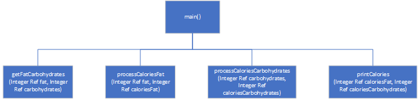

# Calories from Fat and Carbohydrates

## Case

A nutritionist who works for a fitness club helps members by evaluating their diets. As part of her evaluation, she asks members for the number of fat grams and carbohydrate grams that they consumed in a day. Then, she calculates the number of calories that result from the fat, using the following formula:

Calories from Fat = Fat Grams × 9

Next, she calculates the number of calories that result from the carbohydrates, using the following formula:

Calories from Carbs = Carb Grams × 4

The nutritionist asks you to design a modular program that will make these calculations.

<hr>

## Pseudocode

```
Module main()
  Declare Integer fat
  Declare Integer carbohydrates
  Declare Integer caloriesFat
  Declare Integer caloriesCarbohydrates

  Call getFatCarbohydrates(fat, carbohydrates)
  Call processCaloriesFat(fat, caloriesFat)
  Call processCaloriesCarbohydrates(carbohydrates, caloriesCarbohydrates)
  Call printCalories(caloriesFat, caloriesCarbohydrates)
End Module


Module getFatCarbohydrates(Integer Ref fat, Integer Ref carbohydrates)
  Output "Enter a fat :"
  Input fat

  Output "Enter a carbohydrates :"
  Input carbohydrates
End Module


Module processCaloriesFat(Integer Ref fat, Integer Ref caloriesFat)
  Set caloriesFat = fat * 9
End Module


Module processCaloriesCarbohydrates(Integer Ref carbohydrates, Integer Ref caloriesCarbohydrates)
  Set caloriesCarbohydrates = carbohydrates * 4
End Module


Module printCalories(Integer Ref caloriesFat, Integer Ref caloriesCarbohydrates)
  Output "Calories From Fat :", caloriesFat
  Output "Calories From Carbohydrates :", caloriesCarbohydrates
End Module

```

<hr>

## Flowchart


<hr>

## Hierarcy Chart



<hr>

## Source Code

- [C++](caloriesFromFatAndCarbohydrates.cpp)
- [Java](caloriesFromFatAndCarbohydrates.java)
- [Python](caloriesFromFatAndCarbohydrates.py)
- [PHP](caloriesFromFatAndCarbohydrates.php)
- [JavaScript](caloriesFromFatAndCarbohydrates.js)
