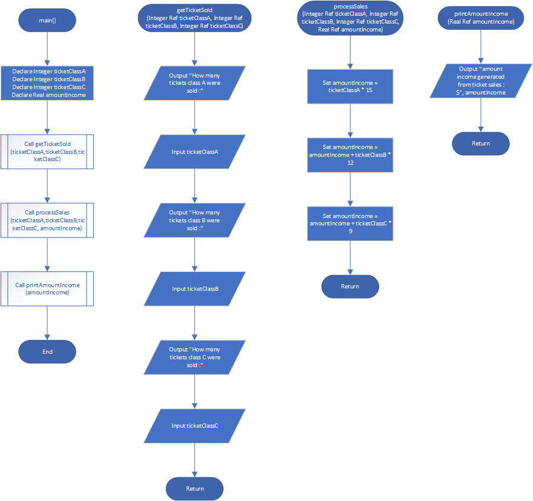
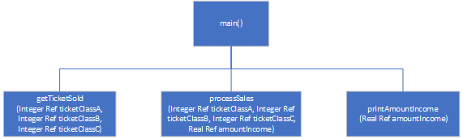

# Stadium Seating

## Case

There are three seating categories at a stadium. For a softball game, Class A seats cost $15, Class B seats cost $12, and Class C seats cost $9. Design a modular program that asks how many tickets for each class of seats were sold, and then displays the amount of income generated from ticket sales.

<hr>

## Pseudocode

```
Module main()
  Declare Integer ticketClassA
  Declare Integer ticketClassB
  Declare Integer ticketClassC
  Declare Real amountIncome

  Call getTicketSold(ticketClassA,ticketClassB,ticketClassC)
  Call processSales(ticketClassA,ticketClassB,ticketClassC, amountIncome)
  Call printAmountIncome(amountIncome)
End Module


Module getTicketSold(Integer Ref ticketClassA, Integer Ref ticketClassB, Integer Ref ticketClassC)
  Output "How many tickets class A were sold :"
  Input ticketClassA
  Output "How many tickets class B were sold :"
  Input ticketClassB
  Output "How many tickets class C were sold :"
  Input ticketClassC
End Module


Module processSales(Integer Ref ticketClassA, Integer Ref ticketClassB, Integer Ref ticketClassC, Real Ref amountIncome)
  Set amountIncome = ticketClassA * 15
  Set amountIncome = amountIncome + ticketClassB * 12
  Set amountIncome = amountIncome + ticketClassC * 9
End Module


Module printAmountIncome(Real Ref amountIncome)
   Output "amount income generated from ticket sales : $", amountIncome
End Module
```

<hr>

## Flowchart



<hr>

## Hierarcy Chart



<hr>

## Source Code

- [C++](stadiumSeating.cpp)
- [Java](stadiumSeating.java)
- [Python](stadiumSeating.py)
- [PHP](stadiumSeating.php)
- [JavaScript](stadiumSeating.js)
