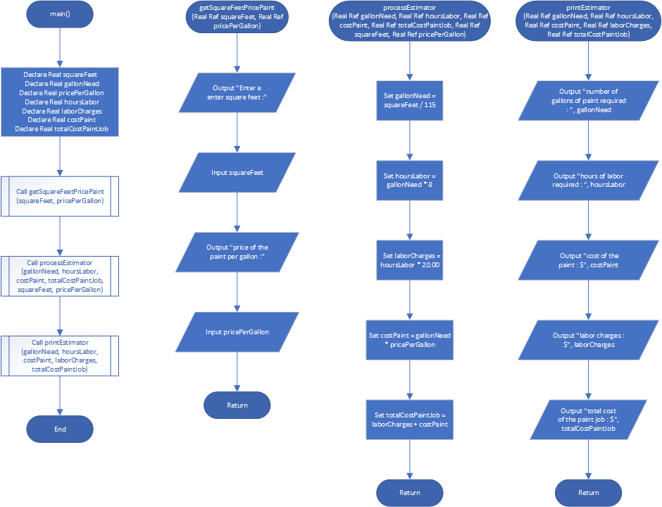

# Paint Job Estimator

## Case

A painting company has determined that for every 115 square feet of wall space, one gallon of paint and eight hours of labor will be required.
The company charges $20.00 per hour for labor.
Design a modular program that asks the user to enter the square feet of wall space to be painted and the price of the paint per gallon.
The program should display the following data:

- The number of gallons of paint required
- The hours of labor required
- The cost of the paint
- The labor charges
- The total cost of the paint job

<hr>

## Pseudocode

```
Module main()
  Declare Real squareFeet
  Declare Real gallonNeed
  Declare Real pricePerGallon
  Declare Real hoursLabor
  Declare Real laborCharges
  Declare Real costPaint
  Declare Real totalCostPaintJob

  Call getSquareFeetPricePaint(squareFeet, pricePerGallon)
  Call processEstimator(gallonNeed, hoursLabor, costPaint, totalCostPaintJob, squareFeet, pricePerGallon)
  Call printEstimator(gallonNeed, hoursLabor, costPaint, laborCharges, totalCostPaintJob)
End Module

Module getSquareFeetPricePaint(Real Ref squareFeet, Real Ref pricePerGallon)
  Output "Enter a enter square feet :"
  Input squareFeet

  Output "price of the paint per gallon :"
  Input pricePerGallon
End Module

Module processEstimator(Real Ref gallonNeed, Real Ref hoursLabor, Real Ref costPaint, Real Ref totalCostPaintJob, Real Ref squareFeet, Real Ref pricePerGallon)
  Set gallonNeed = squareFeet / 115
  Set hoursLabor = gallonNeed * 8
  Set laborCharges = hoursLabor * 20.00
  Set costPaint = gallonNeed * pricePerGallon
  Set totalCostPaintJob = laborCharges + costPaint
End Module

Module printEstimator(Real Ref gallonNeed, Real Ref hoursLabor, Real Ref costPaint, Real Ref laborCharges, Real Ref totalCostPaintJob)
  Output "number of gallons of paint required : ", gallonNeed
  Output "hours of labor required : ", hoursLabor
  Output "cost of the paint : $", costPaint
  Output "labor charges : $", laborCharges
  Output "total cost of the paint job : $", totalCostPaintJob
End Module


```

<hr>

## Flowchart



<hr>

## Hierarcy Chart


<hr>

## Source Code

- [C++](paintJobEstimator.cpp)
- [Java](paintJobEstimator.java)
- [Python](paintJobEstimator.py)
- [PHP](paintJobEstimator.php)
- [JavaScript](paintJobEstimator.js)
