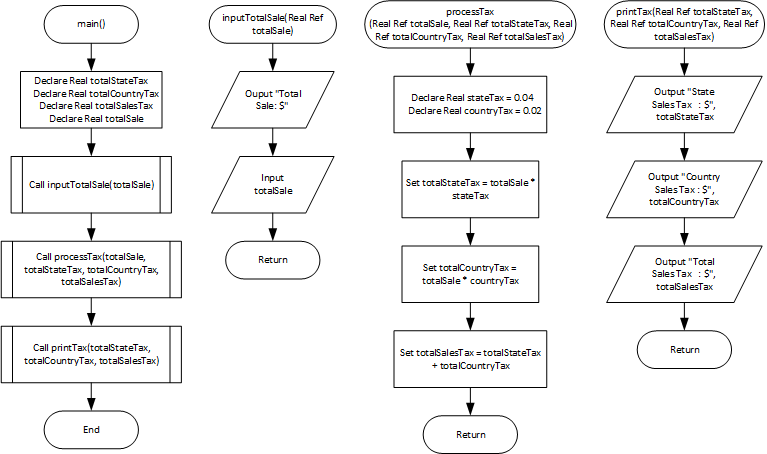
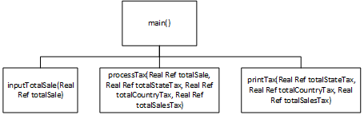

# Monthly Sales Tax program

## Case

A retail company must file a monthly sales tax report listing the total sales for the month, and the amount of state and county sales tax collected.

The state sales tax rate is 4 percent and the county sales tax rate is 2 percent.

Design a modular program that asks the user to enter the total sales for the month.

From this figure, the application should calculate and display the following:

- The amount of county sales tax
- The amount of state sales tax
- The total sales tax (county plus state)

represent the county tax rate (0.02) and the state tax rate (0.04) as named constants.

<hr>

## Pseudocode

```
Module main()
    Declare Real totalStateTax
    Declare Real totalCountryTax
    Declare Real totalSalesTax
    Declare Real totalSale

    Call inputTotalSale(totalSale)
    Call processTax(totalSale, totalStateTax, totalCountryTax, totalSalesTax)
    Call printTax(totalStateTax, totalCountryTax, totalSalesTax)
End Module

Module inputTotalSale(Real Ref totalSale)
    Ouput "Total Sale: $"
    Input totalSale
End Module

Module processTax(Real Ref totalSale, Real Ref totalStateTax, Real Ref totalCountryTax, Real Ref totalSalesTax)
    Declare Real stateTax = 0.04
    Declare Real countryTax = 0.02
    Set totalStateTax = totalSale * stateTax
    Set totalCountryTax = totalSale * countryTax
    Set totalSalesTax = totalStateTax + totalCountryTax
End Module

Module printTax(Real Ref totalStateTax, Real Ref totalCountryTax, Real Ref totalSalesTax)
    Output "State Sales Tax   : $", totalStateTax
    Output "Country Sales Tax : $", totalCountryTax
    Output "Total Sales Tax   : $", totalSalesTax
End Module

```

<hr>

## Flowchart



<hr>

## Hierarcy Chart



<hr>

## Source Code

- [C++](source-code/.cpp)
- [Java](source-code/.java)
- [Python](source-code/.py)
- [PHP](source-code/.php)
- [JavaScript](source-code/.js)
