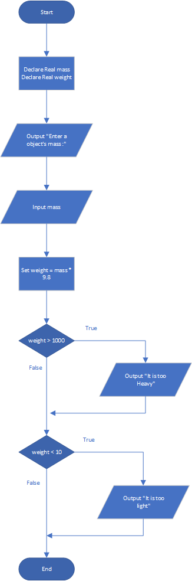

# Mass and Weight

## Case

Scientists measure an object’s mass in kilograms and its weight in Newtons. If youknow the amount of mass of an object, you can calculate its weight, in Newtons, with the following formula:

Weight = Mass × 9.8

Design a program that asks the user to enter an object’s mass, and then calculates its weight. If the object weighs more than 1,000 Newtons, display a message indicating that it is too heavy. If the object weighs less than 10 Newtons, display a message indicating that it is too light.

<hr>

## Pseudocode

```
Declare Real mass
Declare Real weight

Output "Enter a object's mass :"
Input mass

Set weight = mass * 9.8

If weight > 1000 Then
    Output "It is too Heavy"
End If

If weight < 10 Then
    Output "It is too light"
End If
```

<hr>

## Flowchart



<hr>

## Source Code

- [C++](massAndHeight.cpp)
- [Java](massAndHeight.java)
- [Python](massAndHeight.py)
- [PHP](massAndHeight.php)
- [JavaScript](massAndHeight.js)
