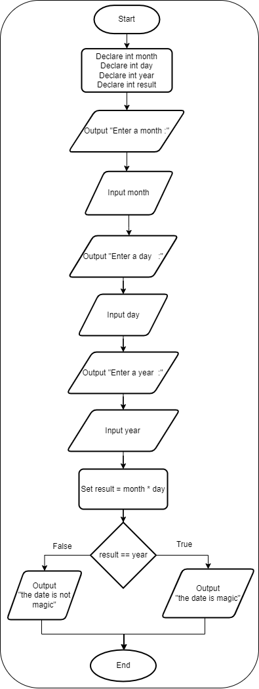

# Magic Dates

## Case

The date June 10, 1960, is special because when it is written in the following format, the month times the day equals the year:

6/10/60

Design a program that asks the user to enter a month (in numeric form), a day, and a two-digit year. The program should then determine whether the month times the day equals the year. If so, it should display a message saying the date is magic. Otherwise, it should display a message saying the date is not magic

<hr>

## Pseudocode

```
Declare int month
Declare int day
Declare int year
Declare int result

Output "Enter a month :"
Input month
Output "Enter a day   :"
Input day
Output "Enter a year  :"
Input year

Set result = month * day

If result == year Then
    Output "the date is magic"
Else
    Output "the date is not magic"
End If
```

<hr>

## Flowchart



<hr>

## Source Code

- [C++](magicDates.cpp)
- [Java](magicDates.java)
- [Python](magicDates.py)
- [PHP](magicDates.php)
- [JavaScript](magicDates.js)
