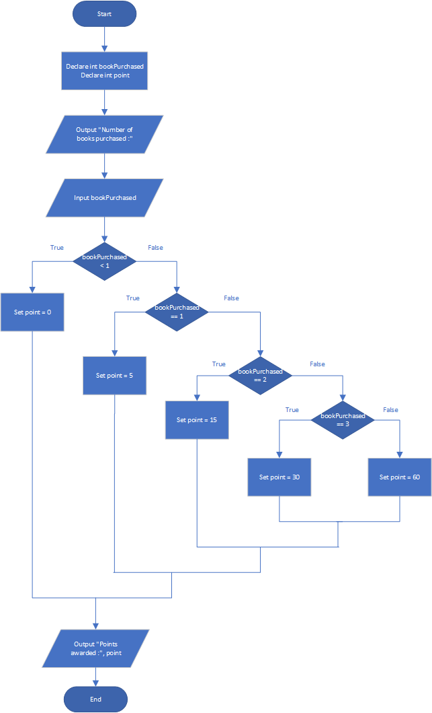

# Book club Points

# Case

Serendipity Booksellers has a book club that awards points to its customers based on the number of books purchased each month. The points are awarded as follows:

- If a customer purchases 0 books, he or she earns 0 points.
- If a customer purchases 1 book, he or she earns 5 points.
- If a customer purchases 2 books, he or she earns 15 points.
- If a customer purchases 3 books, he or she earns 30 points.
- If a customer purchases 4 or more books, he or she earns 60 points.

Design a program that asks the user to enter the number of books that he or she has purchased this month and displays the number of points awarded.

<hr>

## Pseudocode

```
Declare int bookPurchased
Declare int point

Output "Number of books purchased :"
Input bookPurchased

If bookPurchased < 1 Then
    Set point = 0
Else
    If bookPurchased == 1 Then
        Set point = 5
    Else
        If bookPurchased == 2 Then
            Set point = 15
        Else
            If bookPurchased == 3 Then
                Set point = 30
            Else
                    Set point = 60
            EndIf
        EndIf
    EndIf
EndIf

Output "Points awarded :", point
```

<hr>

## Flowchart



<hr>

## Source Code

- [C++](sbookPointClub.cpp)
- [Java](sbookPointClub.java)
- [Python](sbookPointClub.py)
- [PHP](sbookPointClub.php)
- [JavaScript](sbookPointClub.js)
