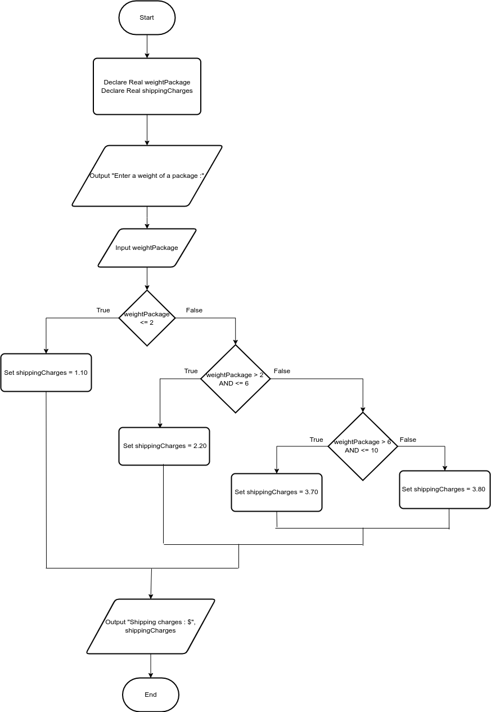

# Shipping Charges

# Case

The Fast Freight Shipping Company charges the following rates:

Weight of Package = Rate per Pound
2 pounds or less = $1.10
Over 2 pounds but not more than 6 pounds = $2.20
Over 6 pounds but not more than 10 pounds = $3.70
Over 10 pounds = $3.80

Design a program that asks the user to enter the weight of a package and then displays the shipping charges.

<hr>

## Pseudocode

```
Declare Real weightPackage
Declare Real shippingCharges

Output "Enter a weight of a package :"
Input weightPackage

If weightPackage <= 2 Then
    Set shippingCharges = 1.10
Else
    If weightPackage > 2 AND <= 6 Then
        Set shippingCharges = 2.20
    Else
        If weightPackage > 6 AND <= 10 Then
            Set shippingCharges = 3.70
        Else
            Set shippingCharges = 3.80
        EndIf
    EndIf
EndIf

Output "Shipping charges : $", shippingCharges
```

<hr>

## Flowchart



<hr>

## Source Code

- [C++](shippingCharges.cpp)
- [Java](shippingCharges.java)
- [Python](shippingCharges.py)
- [PHP](shippingCharges.php)
- [JavaScript](shippingCharges.js)
