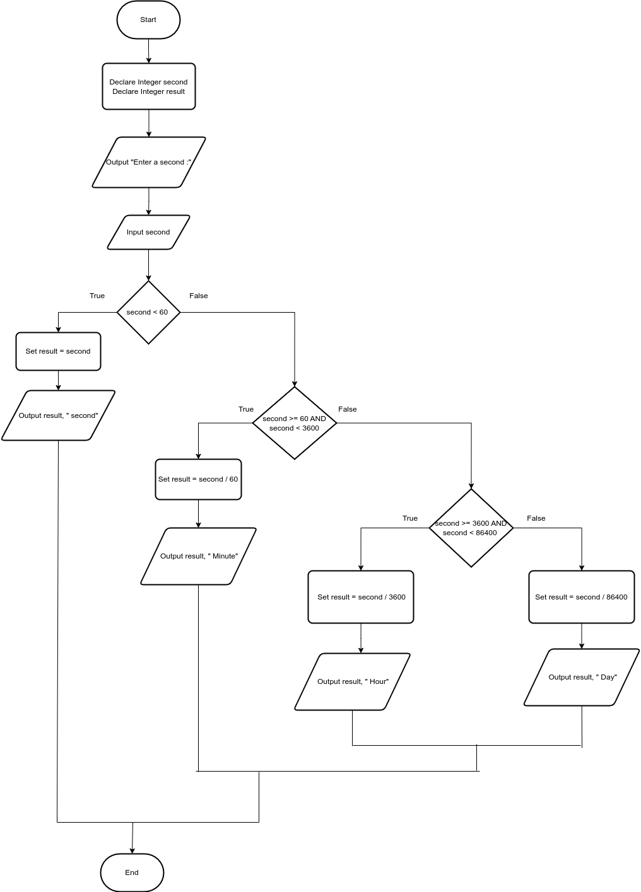

# Time Calculator

## Case

Design a program that asks the user to enter a number of seconds, and works as follows:

- There are 60 seconds in a minute. If the number of seconds entered by the user is greater than or equal to 60, the program should display the number of minutes in that many seconds.

- There are 3,600 seconds in an hour. If the number of seconds entered by the user is greater than or equal to 3,600, the program should display the number of hours in that many seconds.

- There are 86,400 seconds in a day. If the number of seconds entered by the user is greater than or equal to 86,400, the program should display the number of days in that many seconds.

<hr>

## Pseudocode

```
Declare Integer second
Declare Integer result

Output "Enter a second :"
Input second

If second < 60 Then
    Set result = second
    Output result, " second"
Else
    If second >= 60 AND second < 3600 Then
        Set result = second / 60
        Output result, " Minute"
    Else
        If second >= 3600 AND second < 86400 Then
            Set result = second / 3600
             Output result, " Hour"
        Else
            Set result = second / 86400
             Output result, " Day"
        EndIf
    EndIf
EndIf

```

<hr>

## Flowchart



<hr>

## Source Code

- [C++](timeCalculator.cpp)
- [Java](timeCalculator.java)
- [Python](timeCalculator.py)
- [PHP](timeCalculator.php)
- [JavaScript](timeCalculator.js)
