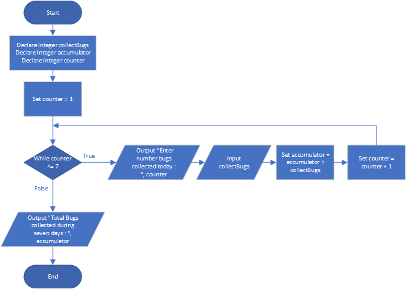

# Bug Collector

## Case

A bug collector collects bugs every day for seven days. Design a program that keeps a running total of the number of bugs collected during the seven days. The loop should ask for the number of bugs collected for each day, and when the loop is finished, the program should display the total number of bugs collected.

<hr>

## Pseudocode

```
Declare Integer collectBugs
Declare Integer accumulator
Declare Integer counter


Set counter = 1
While counter <= 7
  Output "Enter number bugs collected today : ", counter
  Input collectBugs

  Set accumulator = accumulator + collectBugs

  Set counter = counter + 1
End While

Output "Total Bugs collected during seven days : ", accumulator
```

<hr>

## Flowchart



<hr>

## Source Code

- [C++](bugCollector.cpp)
- [Java](bugCollector.java)
- [Python](bugCollector.py)
- [PHP](bugCollector.php)
- [JavaScript](bugCollector.js)
