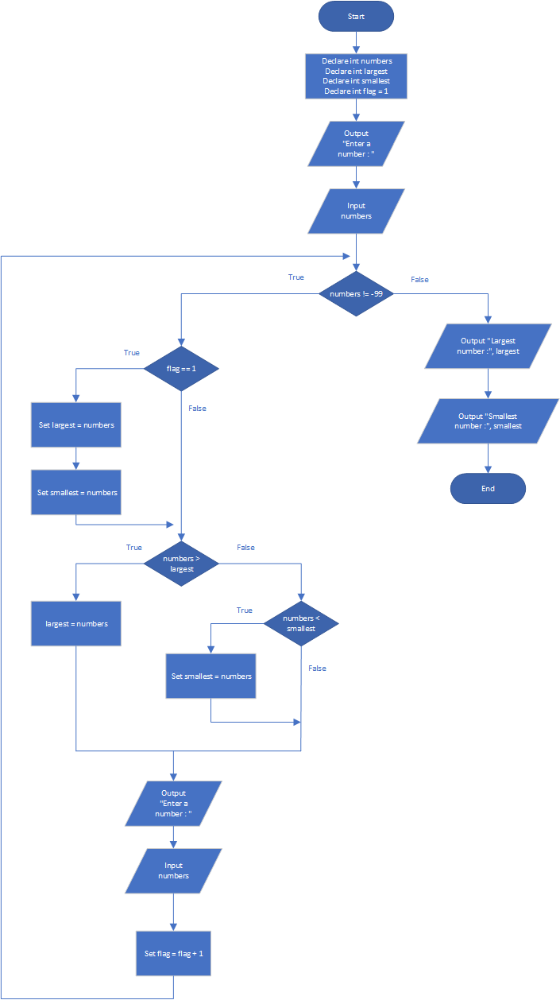

# Largest and Smallest

## Case

Design a program with a loop that lets the user enter a series of numbers. The user should enter –99 to signal the end of the series. After all the numbers have been entered, the program should display the largest and smallest numbers entered

<hr>

## Pseudocode

```
Declare int numbers
Declare int largest
Declare int smallest
Declare int flag = 1

Output "Enter a number : "
Input numbers

While numbers != -99

    If flag == 1 Then
       Set largest = numbers
       Set smallest = numbers
    EndIf

    If numbers > largest Then
        largest = numbers
    Else
        If numbers < smallest Then
        Set smallest = numbers
        EndIf
    EndIf

    Output "Enter a number : "
    Input numbers

    Set flag = flag + 1
EndWhile

Output "Largest number :", largest
Output "Smallest number :", smallest

```

<hr>

## Flowchart



<hr>

## Source Code

- [C++](largestAndSmallest.cpp)
- [Java](largestAndSmallest.java)
- [Python](largestAndSmallest.py)
- [PHP](largestAndSmallest.php)
- [JavaScript](largestAndSmallest.js)
