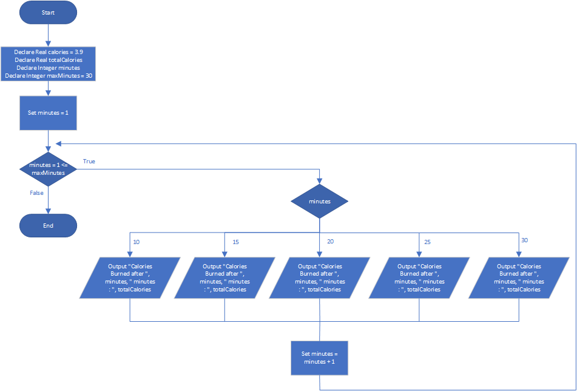

# Calories Burned

## Case

Running on a particular treadmill you burn 3.9 calories per minute. Design a program that uses a loop to display the number of calories burned after 10, 15, 20, 25, and 30 minutes.

<hr>

## Pseudocode

```
Declare Real calories = 3.9
Declare Real totalCalories
Declare Integer minutes
Declare Integer maxMinutes = 30


For minutes = 1 To maxMinutes

  Set totalCalories = calories * minutes

  Select minutes
    Case 10:
      Output "Calories Burned after ", minutes, " minutes : ", totalCalories
    Case 15:
      Output "Calories Burned after ", minutes, " minutes : ", totalCalories
    Case 20:
      Output "Calories Burned after ", minutes, " minutes : ", totalCalories
    Case 25:
      Output "Calories Burned after ", minutes, " minutes : ", totalCalories
    Case 30:
      Output "Calories Burned after ", minutes, " minutes : ", totalCalories
EndFor
```

<hr>

## Flowchart



<hr>

## Source Code

- [C++](caloriesBurned.cpp)
- [Java](caloriesBurned.java)
- [Python](caloriesBurned.py)
- [PHP](caloriesBurned.php)
- [JavaScript](caloriesBurned.js)
