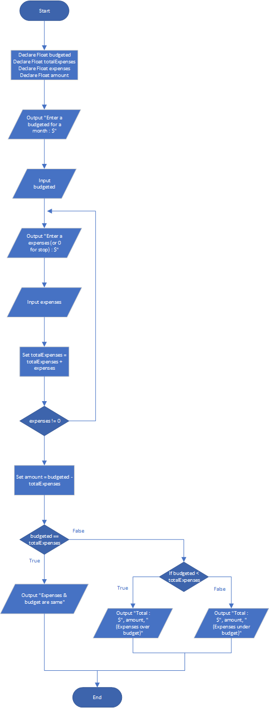

# Budget Analysis

## Case

Design a program that asks the user to enter the amount that he or she has budgeted for a month. A loop should then prompt the user to enter each of his or her expenses for the month, and keep a running total. When the loop finishes, the program should display the amount that the user is over or under budget

<hr>

## Pseudocode

```
Declare Float budgeted
Declare Float totalExpenses
Declare Float expenses
Declare Float amount

Output "Enter a budgeted for a month : $"
Input budgeted

do

  Output "Enter a expenses (or 0 for stop) : $"
  Input expenses

  Set totalExpenses = totalExpenses + expenses

while expenses != 0

Set amount = budgeted - totalExpenses

If budgeted == totalExpenses Then

  Output "Expenses & budget are same"

Else

  If budgeted < totalExpenses

    Output "Total : $", amount, " (Expenses over budget)"

  Else

    Output "Total : $", amount, " (Expenses under budget)"

  EndIf

EndIf
```

<hr>

## Flowchart



<hr>

## Source Code

- [C++](budgetAnalysis.cpp)
- [Java](budgetAnalysis.java)
- [Python](budgetAnalysis.py)
- [PHP](budgetAnalysis.php)
- [JavaScript](budgetAnalysis.js)
