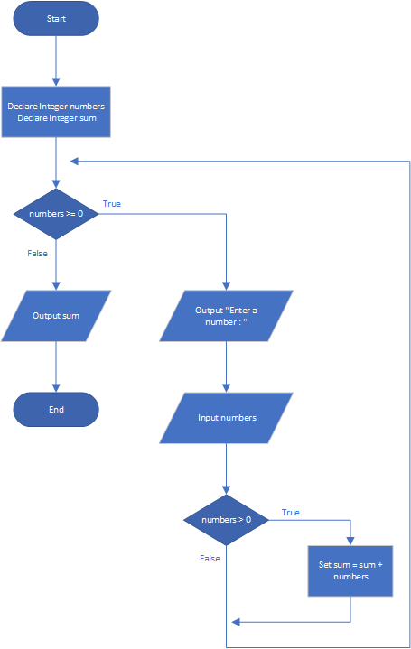

# Sum of Numbers

## Case

Design a program with a loop that asks the user to enter a series of positive numbers.The user should enter a negative number to signal the end of the series. After all the positive numbers have been entered, the program should display their sum.

<hr>

## Pseudocode

```
Declare Integer numbers
Declare Integer sum

while numbers >= 0
  Output "Enter a number : "
  Input numbers

  If numbers > 0 Then
    Set sum = sum + numbers
  End If
End While

Output sum
```

<hr>

## Flowchart



<hr>

## Source Code

- [C++](sumOfNumbers.cpp)
- [Java](sumOfNumbers.java)
- [Python](sumOfNumbers.py)
- [PHP](sumOfNumbers.php)
- [JavaScript](sumOfNumbers.js)
