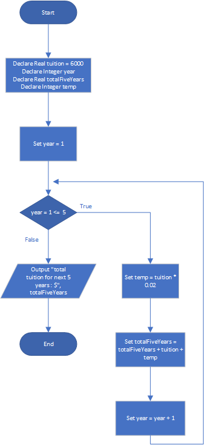

# Tuition Increase

## Case

At one college, the tuition for a full-time student is $6,000 per semester. It has been announced that the tuition will increase by 2 percent each year for the next five years. Design a program with a loop that displays the projected semester tuition amount for the next five years.

<hr>

## Pseudocode

```
Declare Real tuition = 6000
Declare Integer year
Declare Real totalFiveYears
Declare Integer temp

Set year = 1

For year = 1 To 5
  Set temp = tuition * 0.02
  Set totalFiveYears = totalFiveYears + tuition + temp

  Set year = year + 1
EndFor

Output "total tuition for next 5 years : $", totalFiveYears
```

<hr>

## Flowchart



<hr>

## Source Code

- [C++](tuitionIncrease.cpp)
- [Java](tuitionIncrease.java)
- [Python](tuitionIncrease.py)
- [PHP](tuitionIncrease.php)
- [JavaScript](tuitionIncrease.js)
