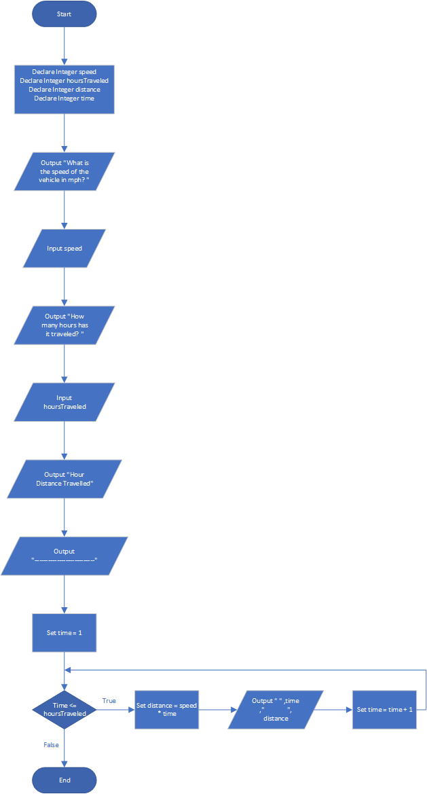

# Distance Traveled

# case

The distance a vehicle travels can be calculated as follows:

Distance = Speed × Time

For example, if a train travels 40 miles per hour for three hours, the distance traveled is 120 miles. Design a program that asks the user for the speed of a vehicle (in miles per hour) and how many hours it has traveled. It should then use a loop to display the distance the vehicle has traveled for each hour of that time period.

<hr>

## Pseudocode

```
Declare Integer speed
Declare Integer hoursTraveled
Declare Integer distance
Declare Integer time

Output "What is the speed of the vehicle in mph? "
Input speed

Output "How many hours has it traveled? "
Input hoursTraveled

Output "Hour     Distance Travelled"
Output "---------------------------"

Set time = 1

for time To hoursTraveled
  Set distance = speed * time

  Output " " ,time ,"              ", distance

  Set time = time + 1
EndFor
```

<hr>

## Flowchart



<hr>

## Source Code

- [C++](distanceTraveled.cpp)
- [Java](distanceTraveled.java)
- [Python](distanceTraveled.py)
- [PHP](distanceTraveled.php)
- [JavaScript](distanceTraveled.js)
