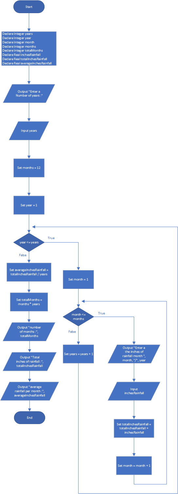

# Average Rainfall

## Case

Design a program that uses nested loops to collect data and calculate the average rainfall over a period of years. The program should first ask for the number of years. The outer loop will iterate once for each year. The inner loop will iterate twelve times, once for each month. Each iteration of the inner loop will ask the user for the inches of rainfall for that month. After all iterations, the program should display the number of months, the total inches of rainfall, and the average rainfall per month for the entire period.

<hr>

## Pseudocode

```
Declare Integer years
Declare Integer year
Declare Integer month
Declare Integer months
Declare Integer totalMonths
Declare Real inchesRainfall
Declare Real totalInchesRainfall
Declare Real averageInchesRainfall

Output "Enter a Number of years :"
Input years

Set months = 12

Set year = 1
For year to years

  Set month = 1
  For month to months

    Output "Enter a the inches of rainfall month ", month, "/", year
    Input inchesRainfall

    Set totalInchesRainfall =  totalInchesRainfall + inchesRainfall

    Set month = month + 1
  EndFor

Set years = years + 1
EndFor

Set averageInchesRainfall = totalInchesRainfall / years
Set totalMonths = months * years

Output "number of months           :", totalMonths
Output "Total inches of rainfall   :", totalInchesRainfall
Output "average rainfall per month :", averageInchesRainfall
```

<hr>

## Flowchart



<hr>

## Source Code

- [C++](averageRainfall.cpp)
- [Java](averageRainfall.java)
- [Python](averageRainfall.py)
- [PHP](averageRainfall.php)
- [JavaScript](averageRainfall.js)
