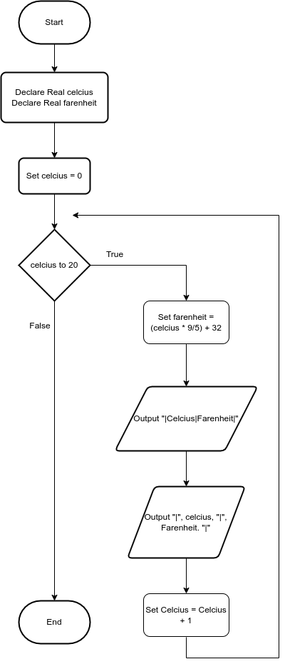

# Celcius to farenheit Table

## Case

Design a program that displays a table of the Celsius temperatures 0 through 20 and their Fahrenheit equivalents. The formula for converting a temperature from Celsius to Fahrenheit is

F = C \* 9/5 + 32

where F is the Fahrenheit temperature and C is the Celsius temperature. Your program must use a loop to display the table.

<hr>

## Pseudocode

```
Declare Real celcius
Declare Real farenheit

Set celcius = 0
For celcius to 20
  Set farenheit = (celcius * 9/5) + 32
  Output "|Celcius|Farenheit|"
  Output "|", celcius, "|", Farenheit. "|"
  Set Celcius = Celcius + 1
EndFor
```

<hr>

## Flowchart



<hr>

## Source Code

- [C++](celciusToFarenheitTable.cpp)
- [Java](celciusToFarenheitTable.java)
- [Python](celciusToFarenheitTable.py)
- [PHP](celciusToFarenheitTable.php)
- [JavaScript](celciusToFarenheitTable.js)
