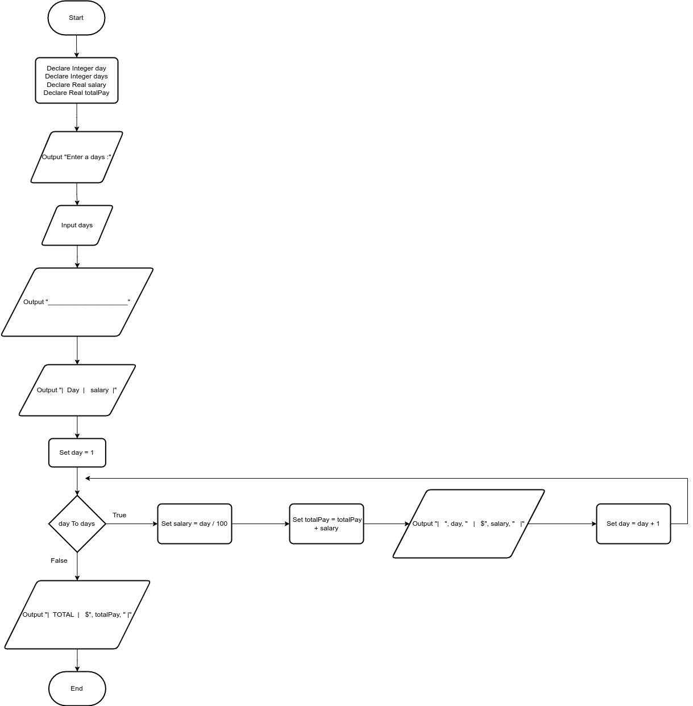

# Pennies for Pay

## Case

Design a program that calculates the amount of money a person would earn over a period of time if his or her salary is one penny the first day, two pennies the second day, and continues to double each day. The program should ask the user for the number of days. Display a table showing what the salary was for each day, and then show the total pay at the end of the period. The output should be displayed in a dollar amount, not the number of pennies

<hr>

## Pseudocode

```
Declare Integer day
Declare Integer days
Declare Real salary
Declare Real totalPay

Output "Enter a days :"
Input days

Output "_____________________"
Output "|  Day  |   salary  |"

Set day = 1
For day To days Then

  Set salary = day / 100
  Set totalPay = totalPay + salary

  Output "|   ", day, "   |   $", salary, "   |"

  Set day = day + 1
EndFor

Output "|  TOTAL  |   $", totalPay, " |"
```

<hr>

## Flowchart



<hr>

## Source Code

- [C++](penniesForPay.cpp)
- [Java](penniesForPay.java)
- [Python](penniesForPay.py)
- [PHP](penniesForPay.php)
- [JavaScript](penniesForPay.js)
