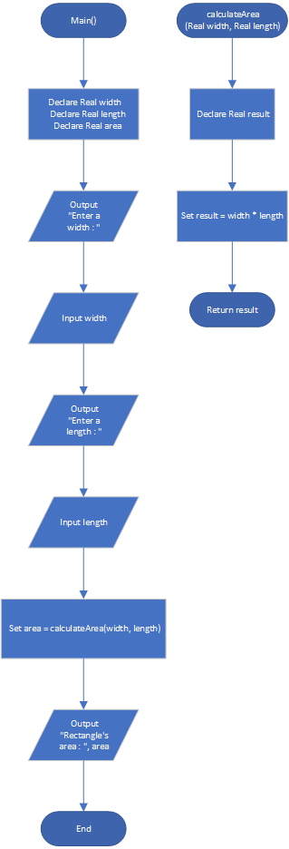

# Rectangle Area

## Case

The area of a rectangle is calculated according to the following formula:

Area = Width × Length

Design a function that accepts a rectangle’s width and length as arguments and returns the rectangle’s area. Use the function in a program that prompts the user to enter the rectangle’s width and length, and then displays the rectangle’s area

<hr>

## Pseudocode

```
Module main()
    Declare Real width
    Declare Real length
    Declare Real area

    Output "Enter a width : "
    Input width
    Output "Enter a length : "
    Input length

    Set area = calculateArea(width, length)

    Output "Rectangle's area : ", area
End Module

Function Real calculateArea(Real width, Real length)
    Declare Real result

    Set result = width * length

    Return result
End Function
```

<hr>

## Flowchart



<hr>

## Source Code

- [C++](rectangleArea.cpp)
- [Java](rectangleArea.java)
- [Python](rectangleArea.py)
- [PHP](rectangleArea.php)
- [JavaScript](rectangleArea.js)
