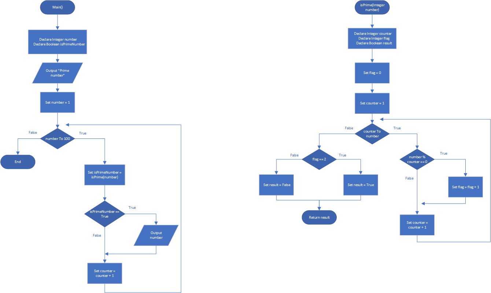

# Prime Number List

## Case

Design another program that displays all of the prime numbers from 1 through 100. The program should have a loop that calls the isPrime function.

<hr>

## Pseudocode

```
Module main()
    Declare Integer number
    Declare Boolean isPrimeNumber

    Output "Prime number"

    Set number = 1
    For number To 100 Then
        Set isPrimeNumber = isPrime(number)

        If isPrimeNumber == True Then
            Output number
        EndIf
        Set counter = counter + 1
    EndFor
End Module

Function Bool isPrime(Integer number)
    Declare Integer counter
    Declare Integer flag
    Declare Boolean result

    Set flag = 0
    Set counter = 1
    For counter To number Then
        If number % counter == 0 Then
            Set flag = flag + 1
        EndIf
    Set counter = counter + 1
    EndFor

    If flag == 2 Then
        Set result = True
    Else
        Set result = False
    EndIf

    Return result
End Function
```

<hr>

## Flowchart



<hr>

## Source Code

- [C++](primeNumberList.cpp)
- [Java](primeNumberList.java)
- [Python](primeNumberList.py)
- [PHP](primeNumberList.php)
- [JavaScript](primeNumberList.js)
