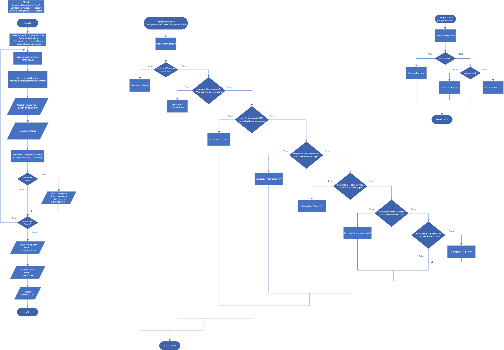

# Rock, Paper, Scissors Game

## Case

Design a program that lets the user play the game of Rock, Paper, Scissors against the computer. The program should work as follows:

(1) When the program begins, a random number in the range of 1 through 3 is generated. If the number is 1, then the computer has chosen rock. If the number is 2, then the computer has chosen paper. If the number is 3, then the computer has chosen scissors. (Don’t display the computer’s choice yet.)
(2) The user enters his or her choice of “rock,” “paper,” or “scissors” at the keyboard.
(3) The computer’s choice is displayed.
(4) The program should display a message indicating whether the user or the computer was the winner.

A winner is selected according to the following rules:

- If one player chooses rock and the other player chooses scissors, then rock wins. (The rock smashes the scissors.)
- If one player chooses scissors and the other player chooses paper, then scissors wins. (Scissors cut paper.)
- If one player chooses paper and the other player chooses rock, then paper wins. (Paper wraps rock.)
- If both players make the same choice, the game must be played again to determine the winner.

<hr>

## Pseudocode

```
Constant String rock = "rock";
Constant String paper = "paper";
Constant String scissors = "scissors";

Module main()
    Declare Integer computerNumber
    Declare String winner
    Declare String computerChoise
    Declare String userChoise

    Do
        Set computerNumber = random(1,3)
        Set computerChoise = rockPaperScissors(computerNumber)

        Output "Choise 'rock', 'paper' or 'scissors' :"
        Input userChoise

        Set winner = determineWinner(computerChoise, userChoise)

        IF winner == "same" Then
            Output "computer & you have same choise, game will played again !!"
        EndIf

    While(winner == "same")

    Output "Computer Choise : ", computerChoise
    Output "your Choise : ", userChoise
    Output winner, " !!!"
End Module

Function String determineWinner(String computerChoise, String userChoise)
    Declare String result

    If computerChoise == userChoise Then
        Set result = "same"
    Else
        If computerChoise == rock AND userChoise == scissors Then
            Set result = "computer win"
        Else
            If userChoise == rock AND computerChoise == scissors Then
                Set result = "You win"
            Else
                If computerChoise == scissors AND userChoise == paper Then
                    Set result = "computer win"
                Else
                    If userChoise == scissors AND computerChoise == paper Then
                        Set result = "You win"
                    Else
                        If computerChoise == paper AND userChoise == rock Then
                            Set result = "computer win"
                        Else
                            If userChoise == paper AND computerChoise == rock Then
                                Set result = "You win"
                            EndIf
                        EndIf
                    EndIf
                EndIf
            EndIf
        EndIf
    EndIf

    Return result
End Function

Function String rockPaperScissors(Integer number)
    Declare String result

    If number == 1 Then
        Set result = rock
    Else
        If number == 2 Then
            Set result = paper
        Else
            Set result = scissors
        EndIf
    End If

    Return result
End Function
```

<hr>

## Flowchart



<hr>

## Source Code

- [C++](rockPaperScissorsGame.cpp)
- [Java](rockPaperScissorsGame.java)
- [Python](rockPaperScissorsGame.py)
- [PHP](rockPaperScissorsGame.php)
- [JavaScript](rockPaperScissorsGame.js)
