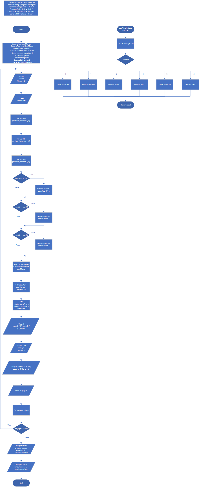

# Slot Machine Simulation

## Case

slot machine is a gambling device that the user inserts money into and then pulls a lever (or presses a button).

The slot machine then displays a set of random images.

If two or more of the images match, the user wins an amount of money, which the slot machine dispenses back to the user.

Design a program that simulates a slot machine.

When the program runs, it should do the following:

- Ask the user to enter the amount of money he or she wants to insert into the slot machine.
- Instead of displaying images, the program will randomly select a word from the following list: Cherries, Oranges, Plums, Bells, Melons, Bars The program will select and display a word from this list three times.
- If none of the randomly selected words match, the program will inform the user that he or she has won $0. If two of the words match, the program will inform the user that he or she has won two times the amount entered. If three of the words match, the program will inform the user that he or she has won three times the amount entered.
- The program will ask whether the user wants to play again. If so, these steps are repeated. If not, the program displays the total amount of money entered into the slot machine and the total amount won.

<hr>

## Pseudocode

```
Constant String cherries = "Cherries"
Constant String oranges = "Oranges"
Constant String plums = "Plums"
Constant String bells = "Bells"
Constant String melons = "Melons"
Constant String bars = "Bars"

Module main()
    Declare Real userMoney
    Declare Real totalUserMoney
    Declare Real totalWon
    Declare Real totalAmountWon
    Declare Integer sameWord
    Declare String word1
    Declare String word2
    Declare String word3
    Declare String playAgain

    Do
        Output "Enter Money : $"
        Input userMoney

        Set word1 = getWord(random(1, 6))
        Set word2 = getWord(random(1, 6))
        Set word3 = getWord(random(1, 6))

        If word1 == word2 Then
            Set sameWord = sameWord + 1
        End If

        If word2 == word3 Then
            Set sameWord = sameWord + 1
        End If

        If word3 == word1 Then
            Set sameWord = sameWord + 1
        End If

        Set totalUserMoney = totalUserMoney + userMoney
        Set totalWon = userMoney * sameWord
        Set totalAmountWon = totalAmountWon + totalWon

        Output word1, " | ", word2, " | ", word3
        Output "You won $", totalWon

        Output "Enter 'Y' To Play again or 'N' for print"
        Input playAgain

        Set sameWord = 0
    While playAgain == "Y"

    Output "total amount money entered : $", totalUserMoney
    Output "total amount won : $", totalAmountWon
End Module

Function String getWord(Integer number)
    Declare String result

    Select number
        Case 1 :
            result = cherries
        Case 2 :
            result = oranges
        Case 3 :
            result = plums
        Case 4 :
            result = bells
        Case 5 :
            result = melons
        Case 6 :
            result = bars
    End Select

    Return result
End Function
```

<hr>

## Flowchart



<hr>

## Source Code

- [C++](slotMachineSimulation.cpp)
- [Java](slotMachineSimulation.java)
- [Python](slotMachineSimulation.py)
- [PHP](slotMachineSimulation.php)
- [JavaScript](slotMachineSimulation.js)
