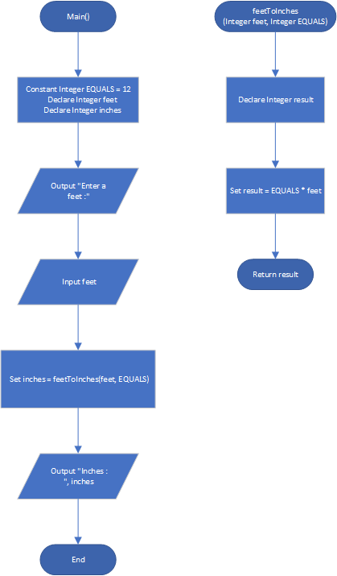

# Feet to Inches

## Case

One feet equals 12 inches. Design a function named feetToInches that accepts a number of feet as an argument, and returns the number of inches in that many feet. Use the function in a program that prompts the user to enter a number of feet and then displays the number of inches in that many feet

<hr>

## Pseudocode

```
Module Main()
    Constant Integer EQUALS = 12
    Declare Integer feet
    Declare Integer inches

    Output "Enter a feet :"
    Input feet

    Set inches = feetToInches(feet, EQUALS)

    Output "Inches : ", inches
End Module

Function Integer feetToInches(Integer feet, Integer EQUALS)
    Declare Integer result

    Set result = EQUALS * feet

    Return result
End Function

```

<hr>

## Flowchart



<hr>

## Source Code

- [C++](feetToInches.cpp)
- [Java](feetToInches.java)
- [Python](feetToInches.py)
- [PHP](feetToInches.php)
- [JavaScript](feetToInches.js)
