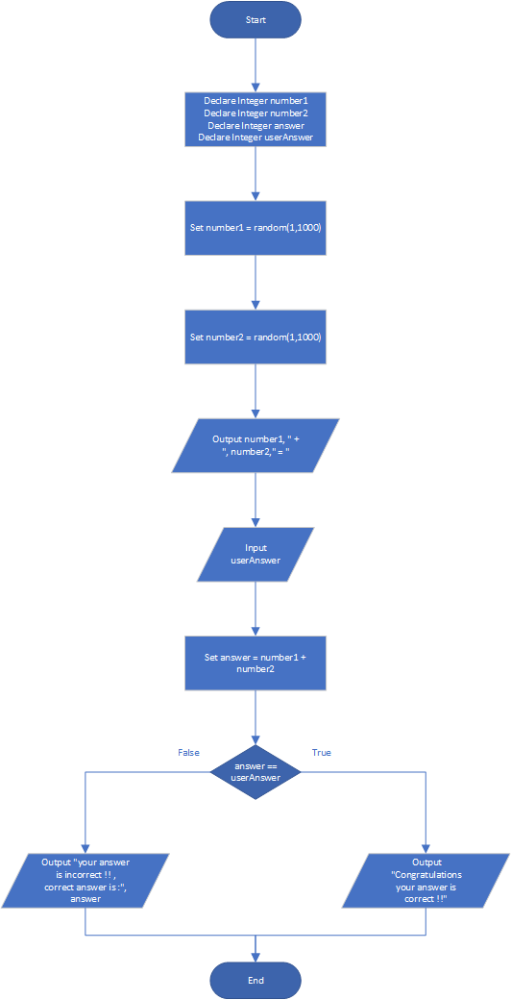

# Math Quiz

## Case

Design a program that gives simple math quizzes. The program should display two random numbers that are to be added, such as:

247 + 129 =

The program should allow the student to enter the answer. If the answer is correct, a message of congratulations should be displayed. If the answer is incorrect, a message showing the correct answer should be displayed.

<hr>

## Pseudocode

```
Declare Integer number1
Declare Integer number2
Declare Integer answer
Declare Integer userAnswer

Set number1 = random(1,1000)
Set number2 = random(1,1000)

Output number1, " + ", number2," = "
Input userAnswer

Set answer = number1 + number2

If answer == userAnswer Then
    Output "Congratulations your answer is correct !!"
Else
    Output "your answer is incorrect !! , correct answer is :", answer
EndIf
```

<hr>

## Flowchart



<hr>

## Source Code

- [C++](mathQuiz.cpp)
- [Java](mathQuiz.java)
- [Python](mathQuiz.py)
- [PHP](mathQuiz.php)
- [JavaScript](mathQuiz.js)
