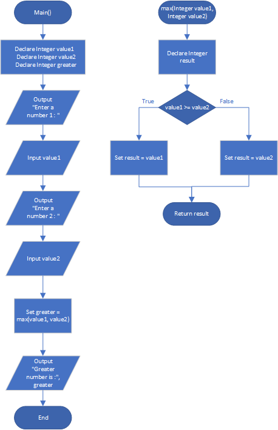

# Maximum of Two Values

## Case

Design a function named max that accepts two integer values as arguments and returns the value that is the greater of the two. For example, if 7 and 12 are passed as arguments to the function, the function should return 12. Use the function in a program that prompts the user to enter two integer values. The program should display the value that is the greater of the two.

<hr>

## Pseudocode

```
Module main()
    Declare Integer value1
    Declare Integer value2
    Declare Integer greater

    Output "Enter a number 1 : "
    Input value1
    Output "Enter a number 2 : "
    Input value2

    Set greater = max(value1, value2)

    Output "Greater number is :", greater
End Module

Function Integer max(Integer value1, Integer value2)
    Declare Integer result

    If value1 >= value2 Then
        Set result = value1
    Else
        Set result = value2
    EndIf

    Return result
End Function
```

<hr>

## Flowchart



<hr>

## Source Code

- [C++](maximumOfTwoValues.cpp)
- [Java](maximumOfTwoValues.java)
- [Python](maximumOfTwoValues.py)
- [PHP](maximumOfTwoValues.php)
- [JavaScript](maximumOfTwoValues.js)
