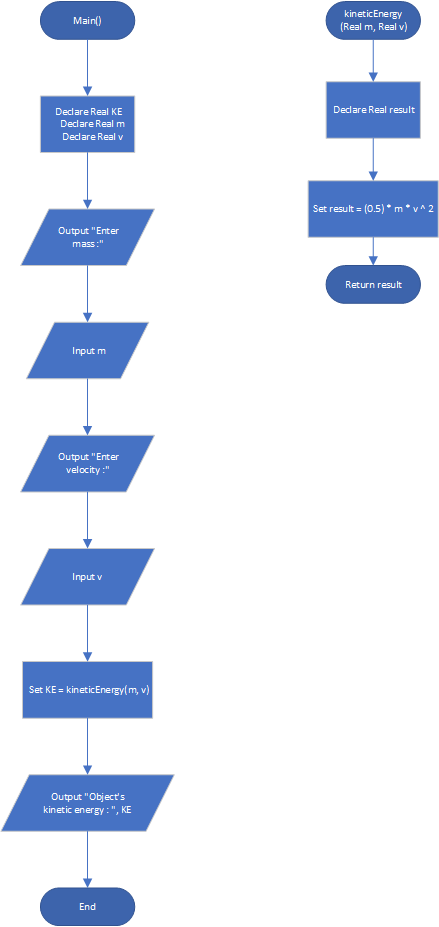

# Kinetic Energy

## Case

In physics, an object that is in motion is said to have kinetic energy. The following formula can be used to determine a moving object’s kinetic energy:

KE = (0.5) \* m \* v ^ 2

The variables in the formula are as follows: KE is the kinetic energy, m is the object’s mass in kilograms, and v is the object’s velocity, in meters per second.

Design a function named kineticEnergy that accepts an object’s mass (in kilograms) and velocity (in meters per second) as arguments.

The function should return the amount of kinetic energy that the object has.

Design a program that asks the user to enter values for mass and velocity, and then calls the kineticEnergy function to get the object’s kinetic energy.

<hr>

## Pseudocode

```
Module main()
    Declare Real KE
    Declare Real m
    Declare Real v

    Output "Enter mass :"
    Input m
    Output "Enter velocity :"
    Input v

    Set KE = kineticEnergy(m, v)

    Output "Object's kinetic energy : ", KE
End Module

Function Real kineticEnergy(Real m, Real v)
    Declare Real result

    Set result = (0.5) * m * v ^ 2

    Return result
End Function
```

<hr>

## Flowchart



<hr>

## Source Code

- [C++](kineticEnergy.cpp)
- [Java](kineticEnergy.java)
- [Python](kineticEnergy.py)
- [PHP](kineticEnergy.php)
- [JavaScript](kineticEnergy.js)
