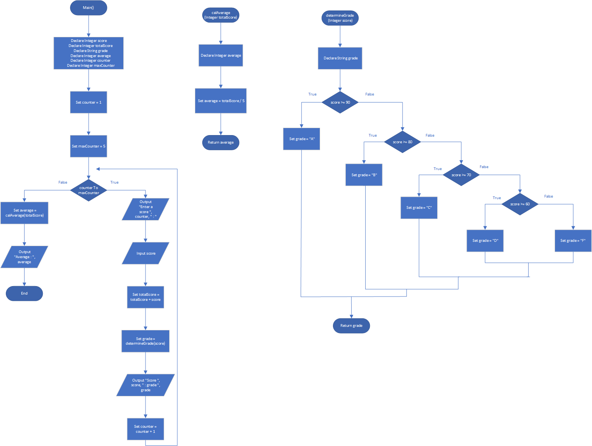

# Test Average and Grade

## Case

Write a program that asks the user to enter five test scores. The program should display a letter grade for each score and the average test score. Design the following functions in the program:

- ( calcAverage ) This function should accept five test scores as arguments and return the average of the scores.

- ( determineGrade ) This function should accept a test score as an argument and return a letter grade for the score (as a String), based on the following grading scale:

Score = Letter Grade
90 - 100 = A
80 - 89 = B
70 - 79 = C
60 - 69 = D
Below 60 = F

<hr>

## Pseudocode

```
Module main()
    Declare Integer score
    Declare Integer totalScore
    Declare String grade
    Declare Integer average
    Declare Integer counter
    Declare Integer maxCounter

    Set counter = 1
    Set maxCounter = 5
    For counter To maxCounter Then
        Output "Enter a score ", counter, " : "
        Input score

        Set totalScore = totalScore + score
        Set grade = determineGrade(score)

        Output "Score ", score, " : grade ", grade

        Set counter = counter + 1
    End For

    Set average = calAverage(totalScore)

    Output "Average : ", average
End Module

Function Integer calAverage(Integer totalScore)
    Declare Integer average

    Set average = totalScore / 5

    Return average
End Function

Function String determineGrade(Integer score)
    Declare String grade

    If score >= 90 Then
        Set grade = "A"
    Else
        If score >= 80 Then
            Set grade = "B"
        Else
            If score >= 70 Then
                Set grade = "C"
            Else
                If score >= 60 Then
                    Set grade = "D"
                Else
                    Set grade = "F"
                End If
            End If
        End If
    End If

    Return grade
End Function
```

<hr>

## Flowchart



<hr>

## Source Code

- [C++](testAverageAndGrade.cpp)
- [Java](testAverageAndGrade.java)
- [Python](testAverageAndGrade.py)
- [PHP](testAverageAndGrade.php)
- [JavaScript](testAverageAndGrade.js)
