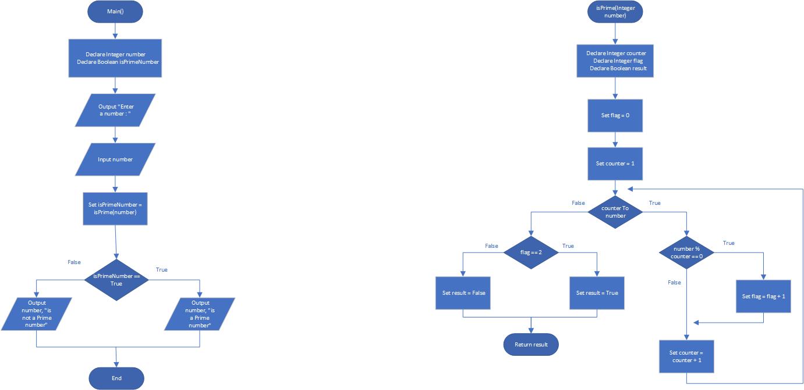

# Prime Numbers

## Case

A prime number is a number that is only evenly divisible by itself and 1. For example, the number 5 is prime because it can only be evenly divided by 1 and 5. The number 6, however, is not prime because it can be divided evenly by 1, 2, 3, and 6.

Design a Boolean function named isPrime, which takes an integer as an argument and returns True if the argument is a prime number, or False otherwise.

Use the function in a program that prompts the user to enter a number and then displays a message indicating whether the number is prime

<hr>

## Pseudocode

```
Module main()
    Declare Integer number
    Declare Boolean isPrimeNumber

    Output "Enter a number : "
    Input number

    Set isPrimeNumber = isPrime(number)

    If isPrimeNumber Then
        Output number, "is a Prime number"
    Else
        Output number, "is not a Prime number"
    EndIf
End Module

Function Bool isPrime(Integer number)
    Declare Integer counter
    Declare Integer flag
    Declare Boolean result

    Set flag = 0
    Set counter = 1
    For counter To number Then

        If number % counter == 0 Then
            Set flag = flag + 1
        EndIf

        If flag == 2 Then
            Set result = True
        Else
            Set result = False
        EndIf

        Set counter = counter + 1
    EndFor

    Return result
End Function
```

<hr>

## Flowchart



<hr>

## Source Code

- [C++](primeNumbers.cpp)
- [Java](primeNumbers.java)
- [Python](primeNumbers.py)
- [PHP](primeNumbers.php)
- [JavaScript](primeNumbers.js)
