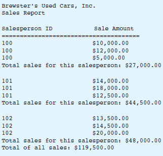

# Sales Report

## Case

Brewster’s Used Cars, Inc. employs several salespeople. Brewster, the owner of the company, has provided a file that contains sales records for each salesperson for the past month.
Each record in the file contains the following two fields:

- The salesperson’s ID number, as an integer
- The amount of a sale, as a real number

The records are already sorted by salesperson ID. Brewster wants you to design a program that prints a sales report.
The report should show each salesperson’s sales and the total sales for that salesperson.
The report should also show the total sales for all salespeople for the month.
Here is an example of how the sales report should appear:



<hr>

## Pseudocode

```
Declare InputFile salesData
Declare String ID
Declare Real saleAmount
Declare Real totalSales
Declare Real totalSalesEachPerson
Declare String tempSaleAmount
Declare String tempID

Open salesData "sales.dat"

Print "Brewster's Used Cars, Inc"
Print "Sales Report"
Print  "\n"

Print "Salesperson ID              Sale Amount"
Print "======================================="

Read salesData ID
Set tempID = ID

While !eof(salesData) Then

    Read salesData saleAmount

    Set tempID = ID
    If tempID != ID Then
        Print "Total Sales for this salesperson : $", totalSalesEachPerson
        Print  "\n"

        Set totalSalesEachPerson = 0;
        Set tempID = ID;
    End If

    Print ID, "\t \t \t \t $", saleAmount
    Set totalSales = totalSales + saleAmount
    Set totalSalesEachPerson = totalSalesEachPerson + saleAmount

    Read salesData ID
    If ID == "EOF" Then
        Print "Total Sales for this salesperson : $", totalSalesEachPerson
    End If

End While

 Print  "\n"
Print "Total of All Sales : $", totalSales

Close salesData
```

<hr>

## Flowchart


<hr>

## Source Code

- [C++](.cpp)
- [Java](.java)
- [Python](.py)
- [PHP](.php)
- [JavaScript](.js)
